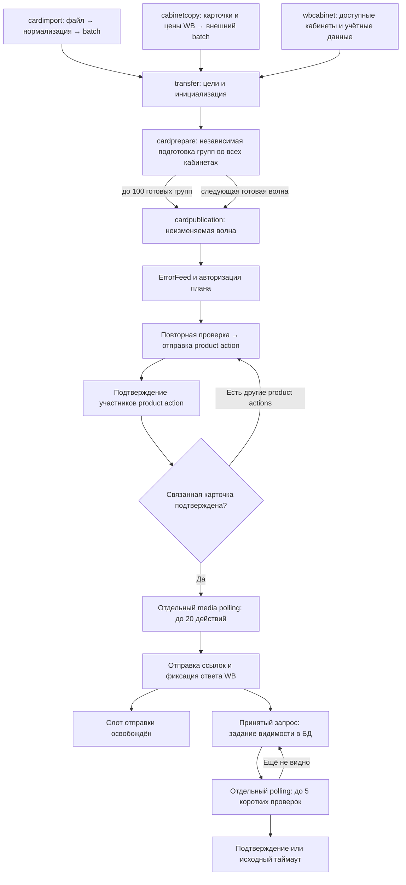

Анализ transfer и связанных фич, 6 сентября 2026
================================================

Состояние исправлений обновлено 10 сентября 2026.

Главная причина задержек — сочетание последовательных этапов обработки, многократного поиска каждого артикула в WB и барьеров, заставляющих готовые карточки ждать самые медленные. Это подтверждается и кодом, и логами реального переноса. В разобранном запуске подготовка заняла 32 минуты, планирование — ещё 12 минут 35 секунд. Только после этого диспетчер начал повторные проверки перед отправкой.

Исходный анализ выполнен по рабочему дереву с незакоммиченным рефакторингом. После анализа в код внесена первая серия исправлений, перечисленная ниже. Источник исходных измерений — [лог 5 сентября](../out/logs/2026-09-05T11-26-35.6268.log), `transfer_id=1`, `batch_id=1`: 602 карточки, 543 группы, 2 кабинета, 1086 заданий подготовки.

Лог отражает поведение до части текущих исправлений: в нём справочники запрашиваются на каждую группу, а проверки медиа достигают примерно 500 запросов за 30 минут. Сейчас есть кеш справочников на проход подготовки, а фотографии проверяются не чаще раза в минуту. Поэтому старые измерения доказывают причины задержки того запуска, но не измеряют скорость актуального кода после этих исправлений.

Время берётся из `duration`/`duration_ms`. Вложенные и параллельные операции нельзя складывать как последовательные этапы. Анализ не включает EXPLAIN ANALYZE, профилирование CPU или новый перенос в WB; точное ускорение изменений пока не измерено.

**Статус реализации на 10 сентября 2026**

- Все polling-процессоры теперь работают независимо: долгая подготовка больше не останавливает планирование, product dispatch, reconciliation и error feed.
- Готовые группы больше не ждут завершения подготовки всего transfer. Планировщик забирает до 100 подготовленных групп в неизменяемую волну; следующие группы продолжают подготовку и попадают в новые планы. Проекция группы хранит `publication_plan_id`, а открытая авторизация ограничена отдельным планом, поэтому несколько волн одного transfer могут одновременно находиться на разных этапах.
- 1086 заданий подготовки выполняются с concurrency 8 и чередуются по кабинетам. Одинаковые запросы справочников объединяются, сетевое чтение не удерживает общий mutex, `CardsLimits` кешируется на 30 секунд.
- Проекция подготовки обновляет существующие счётчики атомарно; transfer проверяет только наличие незавершённой группы. Два полных `COUNT` после каждого результата удалены. Свёртка publication plan теперь делает полный подсчёт actions только при завершении плана.
- Планировщик читает до 100 предложений вместе с их участниками одним batch SQL; каталоги разных кабинетов читаются параллельно.
- Артефакты одной publication-волны сохраняются пакетно: observations и identities — через `UNNEST`, actions и members — через `COPY`, проекции групп и items — двумя массивными `UPDATE`. Число SQL-вызовов сохранения больше не растёт с числом карточек в волне.
- Результат пакетного product action фиксирует все items одним `UPDATE`, media-skip всех групп — вторым, итог групп — одной агрегированной свёрткой. Транзакция больше не выполняет отдельный SQL для каждого участника и каждой группы action.
- После product/media результата transfer проверяет наличие незавершённой группы через частичный индекс. Полная свёртка итогов выполняется один раз — при закрытии последней группы; повторные полные проходы по всем группам и item targets удалены.
- Параллельные результаты actions обновляют независимые item/group projections без удержания блокировки родительской строки transfer. Короткий `FOR UPDATE` берётся только перед финальной свёрткой, чтобы один результат надёжно завершил transfer.
- Для больших наборов артикулов reader пробует полный постраничный снимок в пределах бюджета запросов, затем при необходимости переходит к точечному поиску. Активный каталог и корзина читаются параллельно. `cursor.total` — размер текущей страницы WB; полная страница не завершает обход.
- Product preflight объединяется в снимок на target для текущей группы работников. Reconciliation объединяет до 20 действий по target в один снимок. Для 20 однотоварных действий в одном target тест подтверждает два HTTP-чтения на маленьком каталоге вместо 40 точечных чтений.
- Reconciliation сохраняет доказанный результат каждого участника пакетного product action сразу. Следующий poll запрашивает у WB только участников с `outcome_class IS NULL`; action и transfer-проекция завершаются после фиксации результатов всех участников.
- Частота незавершённого reconciliation уменьшается с возрастом попытки: базовый интервал, затем `3×` после минуты и `6×` после пяти минут.
- Product dispatch и reconciliation выполняются одновременно; выдача действий чередует кабинеты.
- Media actions разрешены сразу после завершения связанного product action. Фаза `media` допускает оставшиеся product actions, а transfer reducer сохраняет эту фазу до полного завершения.
- Media dispatcher освобождает слот после фиксации ответа WB. Для принятого запроса он одной транзакцией завершает HTTP-попытку, переводит action в `reconciling` и сохраняет задание видимости. Отправка новых media actions опрашивается каждые 3 секунды, а отдельный polling видимости выполняет до пяти проверок одновременно не чаще раза в минуту; расписание хранится через `next_check_at`.
- Задание видимости переживает перезапуск: исходный `deadline_at` сохраняется, захват ограничен арендой на две минуты, ревизия отклоняет запоздалый результат предыдущего работника. Одна проверка имеет бюджет 20 секунд, включая ожидание лимитера. Ошибка чтения переносит проверку; остановка сервиса не превращает принятую отправку в терминальную ошибку.
- Таймаут одного логического WB-запроса охватывает ожидание лимитера, HTTP-попытки и retry backoff. Очередь лимитера больше не может скрыто увеличить настроенный 20-секундный бюджет.
- Кеш карточек считает свежесть от времени локального наблюдения, а не от давности `UpdatedAt` товара в WB.

Исходный лог был записан до этих изменений. Для количественной оценки нужен повторный перенос сопоставимого размера; приведённые ниже минуты описывают baseline.

**1. Как проходит загрузка**

Связи задаются в [main.go](../cmd/wb-service/main.go), порядок основного цикла — строки 234–243. `cardimport` формирует входной снимок, `transfer` управляет жизненным циклом и проекциями состояния, `cardprepare` строит проверенные запросы, `cardpublication` планирует, отправляет и подтверждает результат. `statistics` показывает состояние и не входит в последовательность фоновой отправки. `cabinetcopy` — альтернативный вход: последовательно читает страницы исходных карточек, затем цены пакетами; готовит весь batch до запуска transfer. Для этого входа отдельного измеренного примера в разобранном логе нет.

**2. Что измерено**

| Этап | Время | Что объясняет задержку |
| --- | ---: | --- |
| `transfer.initialize` | 0,61 с | Построение команды 0,20 с, сохранение 0,41 с |
| `prepare_transfer` | 32 мин 3,75 с | 1086 заданий обрабатываются по одному |
| Вложенные `catalog_prepare_target` | суммарно 29 мин 17,15 с | Около 91% времени подготовки; последовательные справочники и лимиты |
| `plan_transfer` | 12 мин 34,78 с | Чтение предложений 50,60 с, каталогов 11 мин 38,41 с |
| Построение / сохранение плана | 1,55 / 4,02 с | Здесь не сосредоточены многоминутные задержки |
| `dispatch_product_action`, действие 1 | 5 мин 23,54 с | Повторное чтение каталога 5 мин 3,28 с, отправка 20,02 с |
| `reconcile_product_action`, действие 1, один проход | 3 мин 29,46 с | Чтение каталога 3 мин 28,38 с |
| Первый непустой проход media dispatcher | 30 мин 12,65 с | 20 действий; ожидание видимости внутри работников |
| Основной `poll_cycle=92` | 50 мин 3,05 с | Интервал polling 3 с не ограничивает продолжительность цикла |

Ориентиры в логе: инициализация — строка 1893; подготовка — 14715; план — 17308; действие 1 — 18846; цикл — 18849; подтверждение действия 1 — 20554; первый проход медиа — 41540.

**3. Baseline P0: один последовательный цикл задерживал весь конвейер — исправлено**

До исправления [Polling.Run](../internal/feature/transfer/server/polling.go) вызывал `ProcessPending` процессоров последовательно. Подготовка и планирование обходили все доступные страницы и все переносы, прежде чем вернуть управление. Ограничение страницы 100 не являлось ограничением общего объёма работы за проход.

Следствия:

- Пока подготавливается большой новый перенос, уже готовые к отправке действия других переносов ждут.
- Пока планировщик ищет артикулы одного кабинета, не выполняются авторизация и product dispatcher.
- Уведомление `NotifyFinalized` будит цикл, но не прерывает уже выполняющийся процессор.
- Уменьшение `TRANSFER_POLL_INTERVAL` не сокращает 50-минутный проход.

Дополнительно внутри прежнего `ProductDispatcher.ProcessPending` сначала полностью выполнялся reconciliation, затем начинались новые отправки. Сейчас эти две ветви запускаются одновременно.

Изменение: отдельные обработчики подготовки, планирования, отправки, подтверждения и error feed; ограниченный объём работы за итерацию; возобновляемые задания в БД. Для нескольких работников нужны атомарное получение задания и аренда выполнения. Существующие mutex защищают только один процесс и не заменяют такой механизм.

**4. Baseline P0: готовые карточки ждали самую медленную группу transfer — исправлено**

Раньше фаза transfer оставалась `preparing`, пока не завершались все сочетания группа–кабинет. Только последний результат переводил весь transfer в `awaiting_authorization`. Планировщик дополнительно проверял наличие единственного плана. Поэтому одна медленная группа, временно недоступный кабинет или длинная очередь лимитера задерживали первую отправку всех уже подготовленных карточек.

Теперь успешный результат подготовки сразу становится входом планировщика. Один план содержит не более 100 готовых и ещё не запланированных групп. При сохранении плана каждая группа атомарно получает его `publication_plan_id`; план, digest и состав действий остаются неизменяемыми. Digest версии 2 включает группы и item-решения, поэтому последовательные волны без mutation actions тоже имеют разные подтверждаемые идентификаторы. Подготовка разрешена в активных фазах `preparing`, `awaiting_authorization`, `publishing`, `reconciling` и `media`, поэтому первая волна может авторизоваться, отправляться, подтверждаться и загружать фотографии параллельно с подготовкой следующих волн.

Отклонённые и неразрешённые группы сразу получают terminal-состояние publication/media и не требуют пустого общего плана. Авторизации уникальны по `(transfer_id, plan_id)`, а перепланирование после изменившегося preflight сбрасывает только группы соответствующего плана. Это не повреждает уже выполняющиеся соседние волны. Изменение схемы находится в миграции `000016`.

Граница этой реализации — конкурентные планировщики разных экземпляров пока используют оптимистический конфликт при сохранении одной волны. Транзакция не допускает двойного назначения группы, но один экземпляр может выполнить лишние чтения WB до проигранного конфликта. Атомарная аренда планируемой волны остаётся частью перехода к нескольким экземплярам.

**5. Baseline P0: чтения по одному артикулу повторялись на нескольких этапах — основная часть исправлена**

До исправления [CatalogReader.ReadVendorCodes](../internal/feature/cardpublication/service/catalog/reader.go) для каждого уникального артикула выполнял поиск активной карточки, затем поиск в корзине. Весь список обрабатывался последовательно. При нескольких страницах результатов один поиск делал дополнительные запросы.

Этот метод вызывали независимо:

- планировщик для всех артикулов кабинета;
- диспетчер перед отправкой каждого product action;
- reconciliation при каждой повторной проверке product action.

В плане из лога было 1166 сочетаний артикул–кабинет, по 583 на кабинет. Оба чтения дали **0 попаданий в кеш** и заняли по 5 мин 49 с. Два кабинета читались последовательно. Это объясняет 11 мин 38 с планирования каталогов. Поиск отсутствующих новых карточек тоже стоит HTTP-запроса.

Для `M` сочетаний артикул–кабинет без попаданий в кеш требуется минимум `2M` HTTP-чтений на один полный проход: активные карточки и корзина. Планирование и повторная проверка перед отправкой дают около `4M`, каждое полное подтверждение добавляет ещё до `2M`. Это модель для обрабатываемых на этих этапах артикулов; состав действий и попадания в кеш меняют точное число.

В полном логе: **9560** вызовов `cards.list`, **5853** вызова `cards.trash-list`, **7** вызовов `cards.upload` и **3** вызова `cards.upload-add`. Масштаб расходов на чтение значительно больше числа отправок. Это логические вызовы клиента, некоторые включают повторные HTTP-попытки.

Текущий reader ограничивает пробное постраничное сканирование числом искомых артикулов и 100 страницами; если обход не завершён, выполняется точечный поиск. В большом каталоге проба может добавить запросы — размер всего каталога из `cursor.total` определить нельзя. Это поле описывает текущую страницу, как следует из [документации WB](https://dev.wildberries.ru/docs/openapi/work-with-products). Активный каталог и корзина читаются параллельно. Планирование объединяет артикулы target, product preflight — текущую группу работников, reconciliation — до 20 выбранных действий. Проверка актуальности перед изменением WB сохранена. Оставшаяся работа — фиксировать подтверждение отдельных участников большого action и исключать их из следующих чтений.

**6. Baseline P0: медиа ждали весь план, затем каждую пачку целиком — барьеры сняты**

Первый барьер находился в [ListDispatchableMediaActions](../internal/feature/cardpublication/repository/postgres/media.go): фото нельзя было выбрать при наличии любого незавершённого product action того же плана. Зависимость проходила через весь перенос и все кабинеты, хотя запрос уже проверял связь фото с конкретным завершённым product action и атрибуцией карточки.

Второй барьер был в [MediaDispatcher.ProcessPending](../internal/feature/cardpublication/service/execution/media_dispatcher.go): он выбирал до 20 действий и ждал завершения всей пачки. Внутри `dispatch` после успешной отправки `WaitForMedia` удерживал работника до появления фотографий либо таймаута, по умолчанию 30 минут. Новая выборка выполнялась только после возврата всех работников.

Первый непустой проход из лога: 20 действий, 30 мин 12,65 с. Следующий выбрал только следующие 20. Отдельная goroutine для media polling уже есть, поэтому эти 30 минут не блокируют основной цикл непосредственно; они блокируют очередь медиа и потребляют общий лимит чтения карточек.

Теперь фото разрешены после подтверждения соответствующей карточки с сохранением проверок атрибуции и авторизации; SQL, фазы transfer и редукторы изменены согласованно. Ожидание видимости вынесено в `publication_media_visibility`: отправка освобождает слот сразу после сохранения HTTP-результата. Отдельные короткие проверки используют свежий каталог, сохраняют последнее число фотографий и время следующего чтения. Истечение исходного срока завершает action с `WB_MEDIA_VISIBILITY_TIMEOUT`, успешная проверка — с `WB_MEDIA_VISIBLE`; зафиксированный ответ HTTP-попытки при этом остаётся неизменным. Перезапуск продолжает чтение после истечения аренды и не вызывает повторной отправки фотографий. Изменение требует миграции `000015`.

**7. P1: подтверждение пакетной отправки имело слишком крупную единицу прогресса — исправлено**

Пакетирование создания уже реализовано: [batchTargetCreateActions](../internal/feature/cardpublication/service/planning/planner.go) объединяет до 100 групп с учётом размера запроса. Утверждение «одна карточка — один upload» к этой реализации неприменимо.

Раньше [reconcileProductEvidence](../internal/feature/cardpublication/service/execution/product_reconciliation.go) возвращал `complete=false`, как только встречал первого участника без доказанного результата. Результаты уже найденных участников не сохранялись, а следующий проход снова загружал весь список артикулов.

В логе 49 проходов подтверждения: 39 незавершённых, 6 закончились подтверждением создания, 4 — неопределённым результатом. Ошибка транспорта не доказывает отсутствие отправки: поэтому ожидание подтверждения после таймаута обоснованно. Архитектурная проблема — повторное полное чтение и блокирование прогресса остальных участников.

Теперь классификатор собирает все доказанные результаты текущего poll, даже если часть пакета ещё ожидает WB. Одна транзакция завершает соответствующие строки `publication_action_members`, обновляет product identity и сохраняет attribution либо Error List correlation. SQL выдачи reconciliation включает только незавершённые vendor codes. При последнем результате action завершается, а transfer получает итог всех участников, включая сохранённые в предыдущих poll. Пакетный upload и атомарное завершение группы сохранены.

**8. Baseline P1: политика кеширования плохо соответствовала характеру работы — исправлено**

В старом запуске на 1086 заданий подготовки пришлись 1086 запросов категорий, 1086 запросов характеристик и 1676 страниц брендов, хотя в таймингах всего 55 различных `subject_id`. Именно повторные справочники занимают основную часть 32 минут.

Текущий [ForBatch](../internal/feature/cardprepare/service/preparation/catalog_cache.go) кеширует успешные чтения справочников в пределах одного прохода transfer, отдельно по кабинету и запросу, с ограничением 128 МиБ. Реализованы:

- `CardsLimits` кешируется на 10 минут по кабинету;
- одинаковые одновременные промахи объединяются в один сетевой вызов;
- общий mutex не удерживается во время HTTP;
- [RecentCardsCache](../internal/feature/cardpublication/service/catalog/recent_cards_cache.go) использует время локального наблюдения и TTL 30 секунд.

Кеш подготовки намеренно создаётся отдельно на проход transfer. Отрицательные результаты карточек не используются как доказательство безопасности поздней отправки; вместо этого диспетчер строит общий свежий снимок для текущей группы действий.

Изменение: кеш справочников с ограниченным сроком жизни и объединением одинаковых одновременных запросов по ключу, без удержания общего mutex на HTTP. Лимиты обрабатывать на уровне кабинета/согласованного этапа с локальным учётом планируемого количества, сохраняя свежую проверку перед отправкой. Разделить время изменения WB и время наблюдения карточки; определить допустимую свежесть отдельно для планирования, отправки и подтверждения.

**9. P1: общий лимит чтений превращает лишние проверки в очередь — нагрузка снижена**

Лимитер общий для пары кабинет–bucket: [flowcontrol/registry.go](../internal/core/transport/wb/flowcontrol/registry.go). В [bucket.go](../internal/core/transport/wb/api/content/v1/bucket.go) для чтения активных карточек задан интервал 600 мс и burst 5. Поиск в корзине использует другой bucket — `content_common` с тем же интервалом; поэтому нельзя считать оба поиска одним общим лимитом. Создание карточек ограничивается отдельным bucket с интервалом 6 секунд. Это параметры текущей реализации, а не независимая проверка актуальных правил WB.

В логе для `cards.list` суммарное время вызовов — 23259,6 с, ожидание лимитера — 21243,8 с, то есть около **91,3%**. Для корзины — 3099,0 с и 2281,4 с, около **73,6%**. Эти суммы включают параллельные вызовы и не являются временем переноса по часам.

В старом запуске отдельные проверки медиа делали 498–500 чтений за 30 минут. Они конкурировали за `cards.list` с подтверждением карточек. Теперь одна ожидающая карточка проверяется не чаще раза в минуту, а polling отправки медиа сохранил отдельный интервал 3 секунды. Общий bucket чтений всё ещё разделяется с product preflight и reconciliation.

До исправления product dispatcher с 5 работниками выбирал действия по `target_position, action_id`, поэтому первые работники могли целиком занять один кабинет. Теперь SQL ранжирует действия внутри каждого кабинета и выдаёт их round-robin; подготовка использует тот же принцип, а планировщик читает кабинеты параллельно.

Изменение: справедливое распределение работы по кабинетам, отдельные бюджеты фоновых проверок и отправок внутри допустимого общего лимита. Простое увеличение concurrency увеличивает очередь ожидания и не увеличивает пропускную способность bucket.

**10. P2: множество SQL-вызовов и повторные агрегирования увеличивают стоимость больших переносов — основные повторы исправлены**

В baseline предложения загружались последовательно по группе. `LoadProposal` отдельно читал заголовок и участников. Для 1048 групп в измеренном запуске это заняло **50,60 с**. Теперь планировщик передаёт неизменяемые ссылки всей волны в `LoadProposals`: `UNNEST` сопоставляет до 100 ссылок, а упорядоченные массивы участников возвращаются вместе с каждым предложением. Одна волна выполняет один SQL-запрос вместо прежних запросов на каждую группу. Результат возвращается в порядке входных ссылок; отсутствие или несовпадение любого предложения отклоняет всю загрузку.

В baseline после каждого результата подготовки пересчитывались все группы, а после применения product/media результата transfer снова выполнял `COUNT` по всем `transfer_group_targets` и, для product, по всем `transfer_item_targets`. При `W` группах и `W` сохранениях число посещений строк могло расти как `O(W²)`. Подготовка и свёртка publication plan уже пропускают тяжёлый подсчёт при наличии незавершённой работы. Product/media reducer теперь сначала выполняет индексный `EXISTS` по `overall_outcome = 'running'`; полный подсчёт итогов групп запускается только для результата, закрывающего последнюю группу. Полный проход по item targets из reducer удалён. Пакетные записи items и групп разных actions выполняются параллельно; родительская строка блокируется только на короткой финальной свёртке.

В baseline сохранение плана выполняло отдельный INSERT для каждого observation, action и member, отдельный UPSERT для каждой identity, затем отдельный UPDATE каждой group/item projection. Теперь observations и identities передаются массивами в два SQL, actions и members записываются двумя `COPY`, а все группы и items волны обновляются двумя `UPDATE ... FROM UNNEST`. Вместе с INSERT заголовка и резервированием action IDs это ограниченное число обращений к БД на волну, не зависящее от числа её карточек. Одинаковое наблюдение каталога в следующих инкрементальных волнах переиспользуется по уникальному ключу.

Product action reducer одним запросом агрегирует только items затронутых групп. Его стоимость ограничена размером текущего action и не растёт со всем transfer. Активность transfer проверяется атомарными условиями самих child-обновлений; после них короткая блокировка родителя выбирает транзакцию, которая завершит перенос. CPU построения плана в baseline — 1,55 с; повторное построение индексов каталога внутри `decideGroup` тоже можно вынести на кабинет, но оно не объясняет основную задержку того запуска.

**11. Дополнительные ограничения и границы выводов**

- Один вызов WB теперь получает общий временной бюджет: ожидание лимитера, retry backoff и все HTTP-попытки вместе ограничены `WB_API_TIMEOUT`. Длинные многошаговые проходы по-прежнему получают контекст сервиса, поэтому для них нужны отдельные дедлайны и сохранение прогресса.
- Error feed опрашивает кабинеты последовательно, в основном цикле, с интервалом 30 с. Он может задерживать отправку, но в данном логе его суммарные 36,58 с и максимум одного refresh 5,30 с значительно меньше затрат подготовки и каталога.
- Авторизация имеет TTL 1 час по умолчанию. В разобранном логе автоматическая авторизация трижды завершалась успешно; её нельзя называть доказанной причиной основной задержки. При изменении конвейера следует сохранить корректность продления и проверки разрешения для ещё не начатых действий.
- WB действительно возвращал 500, 400, таймауты отправки и один 429 на медиа. Это дополнительные задержки/неопределённые результаты. Но 32 минуты подготовки и 12,5 минуты планирования прошли до этих отправок.
- 38 заданий подготовки закончились `characteristic_invalid`: это отказы валидации, а не медленное успешное выполнение.
- В старом логе нет последних наблюдённых счётчиков фотографий. По нему нельзя установить, почему конкретные медиа не стали видны: невалидные ссылки, обработка WB или особенности данных требуют отдельной проверки. Такие счётчики уже добавлены в текущий код.
- Измерения `cardimport.finalize` и `cabinetcopy.prepare` отсутствуют: их скорость не подтверждена этим запуском. Инициализация transfer для полученного batch быстрая.

**12. Оставшиеся изменения и проверка результата**

1. Замерить актуальную сборку на сопоставимом переносе. Старые 32 минуты нельзя переносить на текущий код автоматически.
2. Оценить долю общего лимита WB, занятую media visibility, на повторном переносе. Очередь уже сохраняется в БД; при большом числе ожидающих фотографий может понадобиться отдельный бюджет чтений относительно product dispatch/reconciliation.
3. Замерить длительность пакетного сохранения publication plan и применения product result на волнах предельного размера; отдельно оценить короткую финальную блокировку родительской строки transfer.
4. Для запуска нескольких экземпляров добавить атомарное получение заданий отправки и аренду выполнения в БД. Очередь media visibility уже использует `FOR UPDATE SKIP LOCKED` и ревизию аренды; существующее восстановление прерванных отправок по-прежнему рассчитано на один экземпляр.

Для сравнения нужны: время до первой отправки карточек, время до первой загрузки фото, время полного завершения; HTTP-запросы на артикул–кабинет; доля ожидания лимитера; доля попаданий в кеш; число ожидающих и выполняемых заданий по кабинетам; число участников, повторно читаемых при reconciliation. Сравнивать одинаковое число групп, кабинетов и отсутствующих/существующих товаров.

Полный `go test ./...` и race-тесты изменённых конкурентных компонентов проходят. Изменённые SQL-запросы отдельно подготовлены PostgreSQL на локальной схеме без ошибок. Тесты проверяют независимый polling, кеш и объединение одновременных чтений, массовый каталог, пакетный reconciliation, media scheduler, порядок по кабинетам и ограничение concurrency. Это проверка поведения кода, не нагрузочный тест и не подтверждение работы актуальной сборки в WB.

8 сентября дополнительно проверены освобождение слота до появления фотографий, продолжение проверки новым dispatcher без повторной отправки, сохранение принятого HTTP-ответа при остановке, временные ошибки и исходный срок ожидания. На PostgreSQL 18 выполнены миграции в изолированной схеме, подготовка изменённых запросов, захват задания, восстановление после истечения аренды, отклонение устаревшего результата, перенос следующей проверки и завершение задания. Проверка завершена `ROLLBACK`, миграция `000015` в рабочую схему не применялась.

9 сентября на полной временной схеме PostgreSQL проверены миграция `000016`, её откат и повторное применение, подготовка изменённых запросов и поведение двух волн. Проверка подтверждает ранний выбор первой готовой группы, подготовку второй группы в фазе `reconciling`, два одновременных открытых разрешения разных планов и plan-scoped reset без изменения соседней волны. Транзакция завершена `ROLLBACK`; миграция `000016` в рабочую схему не применялась.

9 сентября также проверено частичное product reconciliation: unit-тесты подтверждают сохранение найденного участника при незавершённом соседе, исключение уже сохранённого vendor code из следующей проверки и итоговую свёртку с ранее записанным результатом. PostgreSQL 18 подтвердил, что candidate содержит только незавершённый vendor code, а action не переходит в terminal при наличии незавершённого участника. Изменённые SQL-запросы подготовлены, поведенческая проверка завершена `ROLLBACK`.

9 сентября batch-загрузка предложений проверена на 100 подготовленных группах локальной PostgreSQL 18: один запрос вернул заголовки, payload, metadata и упорядоченных участников всех предложений. SQL-проверка заняла около 194 мс; полный вызов `LoadProposals` через `pgx` с параллельной проверкой JSON и digest — около 1,02 с для 100 предложений и 102 участников. Проверены количество строк, порядок и размеры массивов участников; SQL-транзакция завершена `ROLLBACK`. Это локальная функциональная проверка, а не новый замер полного переноса.

10 сентября PostgreSQL 18 подтвердил новый product/media reducer на текущем transfer из 1086 групп. Обычный результат нашёл оставшуюся `running`-группу через `Index Only Scan` частичного индекса, сохранил уже начатую фазу `media` и не запускал итоговый подсчёт. После транзакционного перевода оставшихся 410 групп в terminal итоговый путь один раз завершил transfer с ожидаемым outcome. Создание индекса, обе проверки состояния и тестовые обновления завершены `ROLLBACK`; миграция `000017` в рабочую схему не применялась.

10 сентября batch-сохранение publication plan проверено через реальный `pgx`: массивный INSERT observations сохранил одну строку для двух одинаковых входных наблюдений, action и member записались через `COPY`, identity — через массивный UPSERT. Отдельная проверка применила `000016` внутри транзакции и успешно обновила group/item projections массивными запросами репозитория. Обе транзакции завершены `ROLLBACK`, временный port-forwarder остановлен; рабочие строки и схема не изменены, PostgreSQL sequences получили допустимые пропуски от тестовых INSERT.

10 сентября пакетное применение product result проверено через реальный `pgx` на существующем action из 119 items и 100 групп. Один массивный UPDATE завершил все items, второй обновил media status, одна сгруппированная свёртка завершила все 100 group projections; быстрый transfer reducer сохранил активную фазу при наличии других незавершённых групп. Проверка завершена `ROLLBACK`, временный port-forwarder остановлен.

10 сентября проверка видимости медиа переведена на минутный интервал независимо от трёхсекундного polling отправки. Unit-тест фиксирует нижнюю границу интервала. Отдельный тест WB client подтверждает, что общий таймаут истекает в очереди лимитера до вызова HTTP transport. Пакетные product/media results больше не держат блокировку transfer во время записи child projections; она перенесена в короткую финальную свёртку. Полный Go test и race-проверка перечисленных компонентов проходят.
