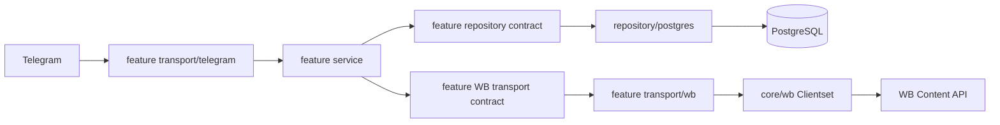
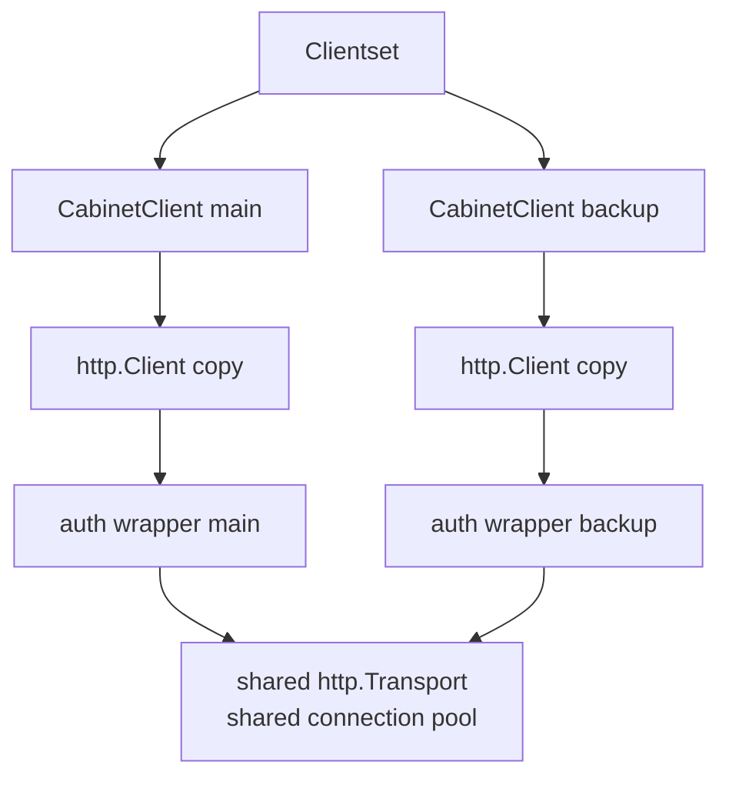
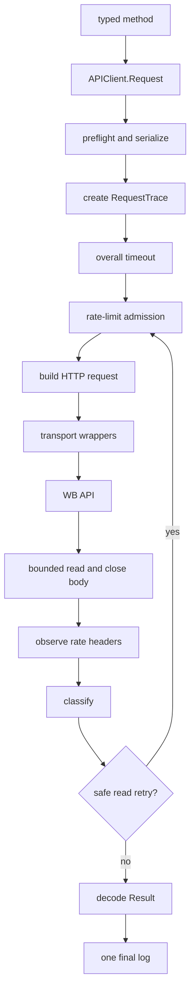

# Архитектурный master-план `wb-service`

## 1. Статус документа

Статус: канонический план текущей реализации `WB Core MVP` и архитектуры
feature-пакетов, ревизия 2026-08-06.

Этот документ заменяет решения о WB core, порядке его реализации и структуре
feature-каталогов из
[`wb-cards-transfer-master-plan.md`](./wb-cards-transfer-master-plan.md).
При расхождении по этим вопросам действует этот документ.

[`wb-cards-transfer-master-plan.md`](./wb-cards-transfer-master-plan.md)
сохраняется как источник продуктовых требований, card-transfer backlog и
будущего production hardening. Его требования к JWT/SellerKey, persistent
binding, singleton process guard, PostgreSQL admission, mutation ticket и
обязательным test gates не входят в текущий MVP.

Документы:

- [`wb-middleware-core-master-plan.md`](./wb-middleware-core-master-plan.md);
- [`featers-transfer.md`](./featers-transfer.md)

остаются историческими материалами.

[`wb-transport-architecture.md`](./wb-transport-architecture.md) описывает
только legacy baseline текущего кода и не задаёт целевую архитектуру.

Будущие усиления вынесены в отдельный план
[`wb-core-future-improvements.md`](./wb-core-future-improvements.md).

Упрощение MVP не отменяет запрет blind retry mutation. Один логический mutation
вызов отправляется в WB не более одного раза. Неизвестный результат нельзя
автоматически повторять.

---

## 2. Основания архитектуры

Новая архитектура объединяет два понятных образца.

### 2.1. Организация WB client по образцу `client-go`

Используются идеи официального Kubernetes Go client:

```text
Config
→ Clientset
→ typed client
→ internal API client
→ Request / Result
→ HTTP transport wrappers
```

Справочные исходники:

- [`client-go/rest/config.go`](https://github.com/kubernetes/client-go/blob/master/rest/config.go);
- [`client-go/rest/client.go`](https://github.com/kubernetes/client-go/blob/master/rest/client.go);
- [`client-go/rest/request.go`](https://github.com/kubernetes/client-go/blob/master/rest/request.go);
- [`client-go/transport/round_trippers.go`](https://github.com/kubernetes/client-go/blob/master/transport/round_trippers.go);
- [`client-go/kubernetes/clientset.go`](https://github.com/kubernetes/client-go/blob/master/kubernetes/clientset.go);
- [`client-go/kubernetes/typed/core/v1/core_client.go`](https://github.com/kubernetes/client-go/blob/master/kubernetes/typed/core/v1/core_client.go).

`client-go` не добавляется как dependency. Код из него не копируется. Берётся
только разделение обязанностей.

### 2.2. Feature layout по образцу `golang-todoapp`

Сохраняется знакомая модель:

```text
Transport → Service ← Repository
```

В каждой feature разрешены только три верхнеуровневых каталога:

```text
service/
repository/
transport/
```

Интерфейс зависимости принадлежит потребителю. Service определяет контракты
repository и исходящих transport. Входящий transport определяет узкий контракт
service. Все зависимости вручную собираются в `cmd/wb-service/main.go`.

### 2.3. Контракт Wildberries

Операции, DTO, статусы, bounds и rate policies сверяются только с официальными
источниками WB:

- [авторизация WB API](https://dev.wildberries.ru/docs/openapi/api-information);
- [работа с товарами WB API](https://dev.wildberries.ru/docs/openapi/work-with-products).

Дата архитектурной сверки: 2026-08-06. Перед реализацией Stage 3 exact wire DTO
и актуальные limits проверяются повторно. Runtime не извлекает контракт из
документации и не угадывает неизвестные поля.

---

## 3. Цель WB Core MVP

Создать единый process-wide клиент Wildberries, который:

- загружает несколько кабинетов из ENV;
- хранит для каждого кабинета ровно один opaque token;
- не передаёт token в features;
- использует один общий пул TCP/TLS-соединений;
- предоставляет typed Content API;
- запрещает feature задавать произвольные HTTP method и path;
- централизует JSON, timeout, rate limiting, retry и классификацию ошибок;
- пишет один итоговый структурированный лог на один логический WB-вызов;
- не повторяет mutation автоматически;
- закрывает idle connections при shutdown;
- остаётся простым для использования из feature `transport/wb`.

После выполнения плана результат называется `WB Core MVP`.

Он достаточен для реализации `cardimport`, `transfer` и `statistics`, но не
считается завершённым production hardening.

---

## 4. Что не входит в MVP

Текущий этап намеренно не реализует:

- JWT parsing;
- криптографическую или структурную проверку token claims;
- `sid` и `SellerKey`;
- автоматическое определение Content capability;
- автоматическое определение read-only token;
- проверку срока действия token;
- duplicate seller detection;
- persistent cabinet-to-seller binding;
- authenticated startup probe;
- token rotation verification;
- singleton advisory lock и process epoch;
- PostgreSQL rate admission;
- durable mutation permits/tickets;
- egress barrier;
- horizontal replicas;
- generated clients;
- dynamic client;
- discovery, informers, watchers и Kubernetes serializers;
- написание новых automated tests.

Существующие тесты не удаляются. Из-за отсутствия новых автоматических тестов
MVP нельзя объявлять доказанным `Gate WB-0` или production-ready.

---

## 5. Общая схема приложения



Ключевая граница:

```text
feature service
не импортирует core/transport/wb
```

Только `feature/.../transport/wb` знает одновременно:

- feature-owned модели и контракты;
- typed DTO и client из `core/transport/wb`.

---

## 6. Целевая структура репозитория

```text
internal/
├── core/
│   ├── domain/
│   ├── errors/
│   ├── logger/
│   ├── repository/
│   │   └── postgres/
│   └── transport/
│       ├── telegram/
│       └── wb/
│           ├── clientset.go
│           ├── cabinet.go
│           ├── types.go
│           ├── errors.go
│           │
│           ├── config/
│           │   ├── env.go
│           │   ├── format.go
│           │   ├── types.go
│           │   └── validation.go
│           │
│           ├── api/
│           │   └── content/
│           │       └── v1/
│           │           ├── operations.go
│           │           ├── bounds.go
│           │           ├── categories.go
│           │           ├── directories.go
│           │           ├── cards.go
│           │           ├── errors.go
│           │           └── media.go
│           │
│           ├── flowcontrol/
│           │   ├── limiter.go
│           │   ├── registry.go
│           │   ├── response.go
│           │   └── backoff.go
│           │
│           ├── policy/
│           │   ├── operation.go
│           │   ├── bucket.go
│           │   ├── retry.go
│           │   └── status.go
│           │
│           ├── client/
│           │   ├── api_client.go
│           │   ├── request.go
│           │   ├── result.go
│           │   ├── trace.go
│           │   ├── delivery.go
│           │   └── errors.go
│           │
│           ├── transport/
│           │   ├── config.go
│           │   ├── transport.go
│           │   ├── wrappers.go
│           │   ├── auth.go
│           │   ├── user_agent.go
│           │   ├── request_id.go
│           │   └── attempt_trace.go
│           │
│           └── typed/
│               └── content/
│                   └── v1/
│                       ├── content_client.go
│                       ├── categories.go
│                       ├── directories.go
│                       ├── cards.go
│                       └── media.go
│
└── feature/
    ├── users/
    │   ├── service/
    │   ├── repository/
    │   │   └── postgres/
    │   └── transport/
    │       └── telegram/
    │
    ├── cardimport/
    │   ├── service/
    │   ├── repository/
    │   │   └── postgres/
    │   └── transport/
    │       ├── telegram/
    │       └── xlsx/
    │
    ├── transfer/
    │   ├── service/
    │   ├── repository/
    │   │   └── postgres/
    │   └── transport/
    │       ├── telegram/
    │       └── wb/
    │
    └── statistics/
        ├── service/
        ├── repository/
        │   └── postgres/
        └── transport/
            └── telegram/
```

В корне feature не создаются дополнительные каталоги:

```text
domain/
application/
gateway/
adapter/
worker/
asset/
source/
```

Их ответственность распределяется между `service`, `repository` и
`transport`.

---

## 7. Правила зависимостей

### 7.1. Разрешённые зависимости

```text
transport/telegram → service
transport/xlsx     → service
transport/wb       → service + core/transport/wb
repository/postgres → service + core PostgreSQL pool
typed/content/v1   → client + api/content/v1
client             → policy + flowcontrol + transport
config             → stdlib + envconfig
Clientset          → config + client + typed/content/v1
cmd/wb-service     → constructors всех компонентов
```

### 7.2. Запрещённые зависимости

```text
service → repository implementation
service → transport implementation
service → Telegram SDK
service → core/transport/wb
service → net/http
repository → transport
transport/telegram → repository
core → feature
feature → raw WB token
feature → *http.Client
feature → произвольный WB method/path
feature → internal client.Request
```

### 7.3. Владение интерфейсами

Service владеет контрактами зависимостей:

```go
type Repository interface {
	CreateTransfer(ctx context.Context, batchID BatchID) (Transfer, error)
	SaveObservation(ctx context.Context, observation Observation) error
}

type WBTransport interface {
	Cabinets(ctx context.Context) ([]Cabinet, error)
	FindCards(
		ctx context.Context,
		cabinetID CabinetID,
		vendorCodes []VendorCode,
	) (CardMatches, error)
	UploadCards(
		ctx context.Context,
		cabinetID CabinetID,
		request UploadRequest,
	) (UploadResult, error)
}
```

`repository/postgres` реализует `Repository`.

`transport/wb` реализует `WBTransport`.

Telegram transport владеет узким контрактом вызываемого service:

```go
type TransferService interface {
	Start(ctx context.Context, batchID string) error
	CurrentStatus(
		ctx context.Context,
		telegramID int64,
	) (Status, error)
}
```

---

## 8. Конфигурация WB

### 8.1. ENV schema

```text
WB_API_BASE_URL=https://content-api.wildberries.ru
WB_API_TIMEOUT=20s
WB_API_USER_AGENT=wb-service/1
WB_API_CABINETS=main,backup

WB_API_CABINET_MAIN_NAME=Основной
WB_API_CABINET_MAIN_TOKEN=<secret>

WB_API_CABINET_BACKUP_NAME=Резервный
WB_API_CABINET_BACKUP_TOKEN=<secret>
```

`main` и `backup` — стабильные технические IDs. Пользовательскими credential
данными являются display name и token.

Все перечисленные кабинеты считаются доступными для Content read/write, потому
что оператор самостоятельно создаёт универсальные WB tokens.

Отдельный `WB_TRANSFER_CABINETS` в MVP не нужен: transfer получает snapshot всех
кабинетов через `Clientset.Cabinets()`.

### 8.2. Проверки MVP

Проверяется только:

- `WB_API_CABINETS` не пуст;
- нет пустых элементов;
- нет duplicate ID;
- name после trim не пуст и укладывается в установленный bound;
- normalized names не повторяются;
- token не пуст;
- token укладывается в установленный size bound;
- surrounding whitespace token считается ошибкой;
- отсутствующий name/token считается ошибкой;
- неизвестные credential-like ENV не выводят secret value.

В MVP `CabinetID` считается стабильной операторской строкой. Оператор использует
схему `shop_NNN` и не переиспользует существующий ID для другого кабинета.
Строгая проверка формата, длины и ENV suffix collision отложена в
[`wb-core-future-improvements.md`](./wb-core-future-improvements.md).

Token не декодируется и не нормализуется.

### 8.3. Типы конфигурации

Типы конфигурации принадлежат пакету
`internal/core/transport/wb/config`. Корневой пакет `wb` не объявляет aliases
для этих типов.

```go
type CabinetID string

type CabinetConfig struct {
	ID    CabinetID
	Name  string
	Token string `json:"-"`
}

type Config struct {
	BaseURL   string
	Timeout   time.Duration
	UserAgent string
	Cabinets  []CabinetConfig
}
```

Конструкторы работают с копией `Config` и не изменяют переданное значение.

`Config.String()`, `Config.GoString()`, `CabinetConfig.String()` и
`CabinetConfig.GoString()` обязаны заменять каждый непустой token на
`--- REDACTED ---`. JSON serialization credentials запрещена; secret field
помечается `json:"-"`.

После создания Clientset raw token остаётся только во внутреннем auth wrapper.

---

## 9. Clientset и модель кабинетов

### 9.1. Один Clientset на процесс

В composition root создаётся ровно один `*wb.Clientset`.

Запрещено создавать отдельный Clientset:

- для feature;
- для worker;
- для одного запроса;
- для одной карточки;
- для одной операции.

### 9.2. Публичная модель кабинета

```go
type CabinetInfo struct {
	ID   config.CabinetID
	Name string
}
```

Snapshots возвращаются как копии. Вызывающий код не может изменить registry
Clientset.

### 9.3. Публичный API Clientset

```go
type Clientset struct {
	// private immutable registry and shared transport
}

func NewForConfig(
	config *config.Config,
	logger *zap.Logger,
) (*Clientset, error)

func NewForConfigAndHTTPClient(
	config *config.Config,
	httpClient *http.Client,
	logger *zap.Logger,
) (*Clientset, error)

func (c *Clientset) Cabinets() []CabinetInfo

func (c *Clientset) ForCabinet(
	id config.CabinetID,
) (*CabinetClient, error)

func (c *Clientset) CloseIdleConnections()
```

`NewForConfigAndHTTPClient` нужен для явного внедрения базового HTTP client.
Конструктор создаёт per-cabinet shallow copies и не изменяет переданный client.

### 9.4. CabinetClient

```go
type CabinetClient struct {
	id        config.CabinetID
	name      string
	contentV1 *contentv1.ContentV1Client
}

func (c *CabinetClient) ID() config.CabinetID
func (c *CabinetClient) Name() string
func (c *CabinetClient) ContentV1() contentv1.ContentV1Interface
```

У одного `CabinetClient` один immutable token. Метода получить token нет.

---

## 10. Сетевая топология нескольких кабинетов

Для каждого кабинета создаётся отдельный логический client, но не отдельный
базовый transport.



Правила:

- `http.DefaultTransport` не изменяется;
- при старте создаётся один clone базового `*http.Transport`;
- clone управляет общим TCP/TLS connection pool;
- каждый кабинет получает лёгкую копию `http.Client`;
- per-cabinet auth wrapper хранит только token этого кабинета;
- wrapper клонирует request/header перед добавлением Authorization;
- wrapper формирует exact header `Authorization: Bearer <token>`;
- redirects запрещены;
- idle connections закрываются один раз через Clientset;
- shutdown одного CabinetClient отдельно не требуется.

Это адаптация client-go: typed clients используют общий сетевой слой, а
per-cabinet auth добавлен из-за нескольких WB tokens.

---

## 11. Transport wrappers

RoundTripper chain содержит только поведение одного физического HTTP attempt:

```text
Request ID
→ User-Agent
→ Authorization
→ attempt trace collector
→ shared base Transport
```

Типы:

```go
type WrapperFunc func(http.RoundTripper) http.RoundTripper

func Chain(
	base http.RoundTripper,
	wrappers ...WrapperFunc,
) http.RoundTripper
```

Wrappers должны быть узкими:

- `RequestID` добавляет локальный correlation ID;
- `UserAgent` устанавливает фиксированный User-Agent;
- `Authorization` добавляет token своего кабинета;
- `AttemptTrace` собирает duration/status для общего trace;
- каждый wrapper клонирует request перед изменением headers;
- ни один wrapper не читает и не закрывает response body;
- ни один wrapper не выполняет retry;
- ни один wrapper не пишет отдельный итоговый request log.

Request ID создаётся один раз для logical Request. Все физические read attempts
получают тот же request ID, а номер попытки хранится отдельно.

В middleware не помещаются:

- DTO validation;
- body serialization;
- rate admission;
- общий timeout;
- retry loop;
- response ownership;
- JSON decode;
- delivery classification;
- лог всего логического запроса.

---

## 12. Закрытый catalog операций

### 12.1. Operation manifest

```go
type Operation struct {
	id               OperationID
	method           string
	path             string
	bucketID         BucketID
	kind             OperationKind
	retryMode        RetryMode
	successStatuses  []int
	requestMode      BodyMode
	responseMode     BodyMode
	maxRequestBytes  int64
	maxResponseBytes int64
}
```

Поля `Operation` закрыты. Feature не создаёт `Operation` и не получает
arbitrary constructor. Read-only accessors не возвращают изменяемые внутренние
slices.

Manifest обязан задавать:

- стабильный operation ID;
- exact HTTP method;
- exact relative path;
- один `BucketID`;
- read или mutation;
- retry mode;
- exact allowed success statuses;
- presence/absence JSON body;
- request/response size bounds;
- operation-specific count bounds.

### 12.2. Catalog Content v1

```text
ParentCategories
Subjects
SubjectCharacteristics
CardsLimits
Brands
DirectoryColors
DirectoryKinds
DirectoryCountries
DirectorySeasons
DirectoryVAT
DirectoryTNVED
CardsList
TrashCardsList
CardsErrorList
UploadCards
UploadCardsAdd
SaveMediaByLinks
```

Не регистрируются в MVP:

- arbitrary method/path;
- update existing cards;
- moveNm;
- delete/recover;
- multipart media;
- Prices API;
- Marketplace API;
- Analytics API.

### 12.3. DTO ownership

Wire DTO лежат в независимом пакете:

```text
core/transport/wb/api/content/v1
```

`typed/content/v1` использует эти DTO и internal `client.Interface`.

Feature service не импортирует wire DTO. Mapping выполняется только в
`feature/.../transport/wb`.

---

## 13. Internal APIClient

Название `RESTClient` в проекте не используется, чтобы не путать outbound API
client с входящим HTTP server.

Внутренний клиент называется `APIClient`:

```go
type APIClient struct {
	baseURL      *url.URL
	httpClient   *http.Client
	rateLimiters *flowcontrol.Registry
	logger       *zap.Logger
}
```

Интерфейс из internal package `client` доступен только typed clients:

```go
type Interface interface {
	Request(operation policy.Operation) *Request
}
```

Feature не получает `APIClient` напрямую.

Не предоставляются публичные методы:

```text
Verb(string)
Path(string)
AbsPath(string)
URL(string)
DoRaw(...)
```

---

## 14. Request builder

### 14.1. Назначение

`Request` хранит описание одного логического WB-вызова:

```go
type Request struct {
	client      *APIClient
	operation   policy.Operation
	query       any
	body        any
	bodyBytes   []byte
	timeout     time.Duration
	err         error
}
```

Builder используется только typed client:

```go
result := apiClient.
	Request(contentapi.CardsListOperation).
	Query(query).
	Body(body).
	Do(ctx)
```

Каждый method builder:

- ничего не отправляет;
- сохраняет первую ошибку;
- не паникует на invalid input;
- не изменяет input DTO;
- не логирует DTO.

### 14.2. Подготовка body

До первого HTTP attempt:

- проверяется ожидаемый DTO type;
- выполняется semantic validation;
- query кодируется один раз;
- JSON body сериализуется один раз;
- проверяются operation bounds;
- immutable `bodyBytes` сохраняются в Request;
- для read retry создаётся новый `bytes.Reader`;
- request body никогда не логируется.

### 14.3. URL safety

`Request` строит URL только из:

- заранее проверенного base URL;
- path из закрытого manifest;
- typed query encoder.

Запрещены:

- смена scheme/host;
- userinfo;
- explicit port;
- fragment;
- arbitrary raw path;
- caller-provided absolute URL;
- redirects.

---

## 15. Result

```go
type Result struct {
	statusCode int
	headers    http.Header
	body       []byte
	err        error
	delivery   DeliveryState
}
```

Методы:

```go
func (r Result) Error() error
func (r Result) StatusCode() int
func (r Result) Delivery() DeliveryState
func (r Result) Into(target any) error
```

Raw response body наружу не возвращается.

`Into`:

- проверяет exact target type;
- не изменяет caller target при failed decode;
- запрещает второй JSON value;
- обрабатывает empty body по manifest;
- публикует decoded value только после полного success.

---

## 16. Typed Content client

### 16.1. Верхний уровень

```go
type ContentV1Interface interface {
	Categories() CategoriesInterface
	Directories() DirectoriesInterface
	Cards() CardsInterface
	Media() MediaInterface
}
```

### 16.2. Cards

```go
type CardsInterface interface {
	Limits(
		ctx context.Context,
	) (*contentapi.CardsLimitsResponse, error)

	List(
		ctx context.Context,
		request contentapi.CardsListRequest,
	) (*contentapi.CardsListResponse, error)

	TrashList(
		ctx context.Context,
		request contentapi.TrashCardsListRequest,
	) (*contentapi.TrashCardsListResponse, error)

	ErrorList(
		ctx context.Context,
		request contentapi.CardsErrorListRequest,
	) (*contentapi.CardsErrorListResponse, error)

	Upload(
		ctx context.Context,
		request contentapi.UploadCardsRequest,
	) (*contentapi.UploadCardsResponse, error)

	UploadAdd(
		ctx context.Context,
		request contentapi.UploadCardsAddRequest,
	) (*contentapi.UploadCardsAddResponse, error)
}
```

### 16.3. Categories

```text
ParentCategories
Subjects
SubjectCharacteristics
Brands
```

### 16.4. Directories

```text
Colors
Kinds
Countries
Seasons
VAT
TNVED
```

### 16.5. Media

```text
SaveByLinks
```

Typed methods выбирают operation manifest сами. Caller не передаёт method,
path, bucket или retry mode.

---

## 17. Request lifecycle

Один typed method создаёт один логический Request:



Порядок обязан обеспечивать:

1. Trace создаётся до выполнения изменяемых стадий.
2. Rate limiter вызывается перед каждым физическим attempt.
3. Новый `http.Request` создаётся для каждого read retry.
4. Authorization добавляется только к окончательно построенному request.
5. Response body имеет одного владельца.
6. Body bounded читается и закрывается до следующего attempt.
7. Mutation никогда не проходит вторую итерацию retry loop.
8. Final log пишется один раз через внешний lifecycle observer.

---

## 18. Rate limiting и backoff MVP

### 18.1. Ключ limiter

```text
(CabinetID, BucketID)
```

`SellerKey` в MVP отсутствует.

### 18.2. Registry

```go
type Registry struct {
	// immutable policies and lazily-created limiters
}

func (r *Registry) Wait(
	ctx context.Context,
	cabinetID CabinetID,
	bucketID BucketID,
) error

func (r *Registry) Observe(
	cabinetID CabinetID,
	bucketID BucketID,
	response *http.Response,
) error
```

Каждая operation использует ровно один `BucketID`.

### 18.3. Ограничения MVP

- limiter хранится в памяти процесса;
- состояние сбрасывается при restart;
- несколько processes не координируются;
- одинаковый seller в двух CabinetID не распознаётся;
- очередь ожидания bounded;
- cancellation прекращает ожидание;
- `Retry-After` и разрешённые WB rate headers bounded парсятся;
- headers никогда не могут увеличить configured burst выше policy.

PostgreSQL admission остаётся future improvement.

---

## 19. Retry и delivery semantics

### 19.1. DeliveryState

```go
type DeliveryState uint8

const (
	NotDispatched DeliveryState = iota
	ResponseReceived
	UnknownDelivery
)
```

### 19.2. Read

Read operation может повторяться только если manifest разрешает retry и:

- ошибка transport входит в allowlist;
- WB вернул retryable `429`;
- WB вернул разрешённый `5xx`;
- общий deadline не истёк;
- max attempts не исчерпан;
- request body можно восстановить из immutable bytes.

### 19.3. Mutation

Mutation:

- выполняет максимум один `http.Client.Do` на один typed method call;
- не повторяется после `429` внутри core;
- не повторяется после timeout, EOF или connection reset;
- возвращает `NotDispatched`, если HTTP ещё не начинался;
- возвращает `ResponseReceived`, если получен явный HTTP response;
- возвращает `UnknownDelivery`, если HTTP начался, но достоверного response нет.

Feature обязана сохранять unknown outcome и выполнять reconciliation. Повторный
mutation вызов — отдельное durable feature-решение, а не скрытая логика core.

### 19.4. Ошибки

```go
type ClassifiedError interface {
	error
	Code() string
	Delivery() DeliveryState
	RetryAfter() time.Duration
}
```

Business control flow не анализирует текст `error.Error()`.

---

## 20. Единый лог WB-запроса

### 20.1. Инвариант

```text
один typed method call
→ один Request.Do
→ один RequestTrace
→ одна итоговая log entry
```

Read retries не создают отдельные итоговые logs.

### 20.2. RequestTrace

```go
type RequestTrace struct {
	RequestID      string
	CabinetID      CabinetID
	CabinetName    string
	Operation      OperationID
	Method         string
	Path           string
	BucketID       BucketID
	StartedAt      time.Time
	Attempts       []AttemptTrace
	RequestBytes   int
	ResponseBytes  int
	LimiterWait    time.Duration
	StatusCode     int
	Delivery       DeliveryState
	ErrorCode      string
	WBRequestID    string
}
```

`AttemptTrace` bounded числом configured read attempts.

### 20.3. Итоговое событие

```text
event=wb_request_completed
request_id
cabinet_id
cabinet_name
operation
method
path
bucket_id
attempt_count
attempt_statuses
limiter_wait
request_bytes
response_bytes
duration
status_code
delivery_state
result
error_code
wb_request_id
```

### 20.4. Запрещённые данные

Не логируются:

- token;
- Authorization;
- request body;
- response body;
- raw claims;
- raw error body;
- sensitive query values;
- full Config без redaction.

Transport wrapper может собирать данные attempt, но не пишет собственное
событие `wb_request_completed`.

---

## 21. Feature layout

### 21.1. Общий шаблон

```text
internal/feature/<name>/
├── service/
├── repository/
└── transport/
```

В корне feature не остаётся `feature.go`. Wiring находится в composition root.

### 21.2. Service

`service` содержит:

- feature models;
- business rules;
- use cases;
- orchestration;
- repository contracts;
- outbound transport contracts;
- worker orchestration;
- feature errors;
- state transitions.

Пример transfer:

```text
service/
├── service.go
├── contracts.go
├── models.go
├── errors.go
├── start.go
├── prepare.go
├── dispatch.go
├── reconcile.go
└── worker.go
```

### 21.3. Repository

`repository` содержит только persistence adapters:

```text
repository/
└── postgres/
    ├── repository.go
    ├── models.go
    ├── create_transfer.go
    ├── claim_job.go
    ├── save_attempt.go
    └── save_observation.go
```

PostgreSQL models не выходят за package repository.

### 21.4. Transport

`transport` содержит внешние протоколы и форматы:

- `transport/telegram` — входящие user actions;
- `transport/wb` — исходящие WB API calls;
- `transport/xlsx` — разбор внешнего XLSX;
- `transport/http` — будущий public media/health HTTP;
- `transport/filesystem` — внешний файловый формат/источник при необходимости.

Пример transfer:

```text
transport/
├── telegram/
│   ├── transport.go
│   ├── contracts.go
│   ├── handlers.go
│   └── presenter.go
└── wb/
    ├── transport.go
    ├── cards.go
    ├── media.go
    ├── mapper.go
    └── errors.go
```

### 21.5. Распределение прежних каталогов

| Прежнее проектное имя | Новое место |
|---|---|
| `domain`, `application` | `service/*.go` |
| `worker` | `service/*_worker.go` |
| `gateway/wb` | `transport/wb` |
| `adapter/xlsx` | `transport/xlsx` |
| Telegram adapter | `transport/telegram` |
| PostgreSQL adapter | `repository/postgres` |
| asset HTTP fetch/serve | `transport/http` |
| asset persistence | `repository/postgres` или `repository/filesystem` |

---

## 22. Feature-specific WB transport

`feature/transfer/transport/wb` выполняет четыре задачи:

1. Получает feature models от service.
2. Преобразует их в core WB wire DTO.
3. Вызывает typed Clientset API.
4. Преобразует result/classified error обратно в feature result.

Пример:

```go
type Transport struct {
	clients *corewb.Clientset
}

func (t *Transport) FindCards(
	ctx context.Context,
	cabinetID transfer_service.CabinetID,
	vendorCodes []transfer_service.VendorCode,
) (transfer_service.CardMatches, error) {
	cabinet, err := t.clients.ForCabinet(
		corewb.CabinetID(cabinetID),
	)
	if err != nil {
		return transfer_service.CardMatches{}, err
	}

	request := mapCardsListRequest(vendorCodes)

	response, err := cabinet.
		ContentV1().
		Cards().
		List(ctx, request)
	if err != nil {
		return transfer_service.CardMatches{}, mapWBError(err)
	}

	return mapCardMatches(response), nil
}
```

Service не видит core DTO и не зависит от client-go-inspired деталей.

---

## 23. Composition root

Ручной dependency injection остаётся в `cmd/wb-service/main.go`, как в
`golang-todoapp`.

Порядок:

```text
application config
→ logger
→ PostgreSQL pool
→ Telegram server
→ WB Config
→ one WB Clientset
→ repositories
→ outbound transports
→ services
→ inbound Telegram transports
→ handler registration
→ run
```

Пример:

```go
wbConfig := wbconfig.NewConfigMust()

wbClientset, err := corewb.NewForConfig(
	&wbConfig,
	logger.Logger,
)
if err != nil {
	return fmt.Errorf("create WB clientset: %w", err)
}
defer wbClientset.CloseIdleConnections()

transferRepository := transfer_postgres.New(postgresPool)
transferWBTransport := transfer_wb.New(wbClientset)

transferService := transfer_service.New(
	transferRepository,
	transferWBTransport,
)

transferTelegram := transfer_telegram.New(
	transferService,
)

transferTelegram.Register(telegramHandler)
```

Один Clientset передаётся во все feature WB transports.

---

## 24. Lifecycle и shutdown

При startup:

1. Config полностью загружается и валидируется.
2. Создаётся один shared base Transport.
3. Создаётся in-memory rate registry.
4. Для каждого кабинета строится auth wrapper и CabinetClient.
5. Registry публикуется только после успешной сборки всех кабинетов.
6. После этого регистрируются features и начинается Telegram intake.

При shutdown:

1. Root context отменяется.
2. Новые operations перестают стартовать через application coordination.
3. Ожидания limiter завершаются по context.
4. Активные HTTP calls получают cancellation.
5. Feature сохраняет известное durable состояние.
6. `Clientset.CloseIdleConnections()` вызывается один раз.

MVP не реализует singleton protection от второго процесса.

---

## 25. Security baseline MVP

Обязательные правила даже для упрощённого MVP:

- production base URL использует HTTPS;
- host allowlisted;
- redirects запрещены;
- token не trim-ится;
- token не передаётся через context;
- token не экспортируется из CabinetClient;
- token не попадает в `String`, `GoString`, JSON и logs;
- `Authorization: Bearer <token>` добавляется только per-cabinet auth wrapper;
- caller не может установить arbitrary Authorization;
- request/response bodies не логируются;
- error preview не выходит в feature как raw body;
- feature не может указать arbitrary method/path;
- mutation не retry-ится автоматически.

---

## 26. Реализация по этапам

Каждый этап является отдельным reviewable change set. После сообщения
пользователя `ок` Codex самостоятельно читает diff, проверяет полноту
реализации, сборку, vet и formatting/diff integrity. Пользователю не
перекладывается список проверочных команд. Новые test-файлы не создаются.

### Stage 0. Legacy inventory и безопасный cleanup

Deliverables:

- инвентаризация текущих callers и exported API;
- список legacy-компонентов;
- удаление только реально мёртвых helpers;
- сохранение используемых `Client`, `ScopedClient`, `DoJSON`, limiter и logger
  до появления замены;
- фиксация atomic replacement order.

Нельзя сначала удалить рабочий старый path и оставить branch некомпилируемым.

### Stage 1. Config и базовые типы

Deliverables:

- `CabinetID`;
- `CabinetConfig`;
- `CabinetInfo`;
- multi-cabinet ENV loader;
- bounded validation;
- deterministic ordering;
- redacted `String`/`GoString`;
- immutable internal credentials.

### Stage 2. Shared transport foundation

Deliverables:

- один clone base `*http.Transport`;
- safe HTTP client copying;
- redirect prohibition;
- wrapper abstraction/chain;
- Request ID wrapper;
- User-Agent wrapper;
- per-cabinet Authorization wrapper;
- attempt trace collector;
- close idle connection ownership.

### Stage 3. Policy и Content API types

Deliverables:

- closed `Operation` manifest;
- stable operation IDs;
- one `BucketID` per operation;
- read/mutation classification;
- retry modes;
- allowed success statuses;
- size/count bounds;
- exact Content v1 request/response DTO;
- полный operation inventory из раздела 12.

### Stage 4. Internal APIClient, Request и Result

Deliverables:

- internal `client.Interface`;
- `APIClient`;
- error-accumulating Request builder;
- query/body preparation;
- immutable body bytes;
- safe URL construction;
- bounded response ownership;
- `Result`;
- strict `Into`;
- `DeliveryState` и classified errors.

### Stage 5. Flowcontrol и retry

Deliverables:

- in-memory limiter registry;
- `(CabinetID, BucketID)` key;
- response header observation;
- bounded backoff;
- read retry loop;
- request recreation;
- mutation one-shot rule;
- unknown delivery classification.

### Stage 6. Единый RequestTrace и logger

Deliverables:

- один trace на logical request;
- bounded attempt summaries;
- accumulated limiter wait;
- request/response sizes;
- final status/delivery/error fields;
- одно событие `wb_request_completed`;
- отсутствие отдельного terminal log на каждый attempt;
- отсутствие secret/body leakage.

### Stage 7. Typed ContentV1 clients

Deliverables:

- `ContentV1Client`;
- Categories client;
- Directories client;
- Cards client;
- Media client;
- typed interfaces;
- operation selection внутри typed methods;
- отсутствие arbitrary low-level API у feature.

### Stage 8. Clientset и cabinets

Deliverables:

- один `Clientset`;
- deterministic immutable cabinet registry;
- per-cabinet logical clients;
- shared base transport;
- `Cabinets()` snapshots;
- `ForCabinet()`;
- `ContentV1()`;
- all-or-error startup construction;
- `CloseIdleConnections()`.

### Stage 9. Feature structure alignment

Deliverables:

- только `service/repository/transport` в новых features;
- перенос `gateway/wb` в `transport/wb`;
- перенос XLSX adapter в `transport/xlsx`;
- contracts принадлежат consumers;
- feature models не зависят от core WB DTO;
- wiring уходит из root `feature.go` в composition root.

### Stage 10. Первый feature WB transport

Deliverables:

- `feature/transfer/transport/wb`;
- mapping feature models ↔ Content v1 DTO;
- вызовы `ForCabinet().ContentV1()`;
- normalized feature errors;
- отсутствие raw HTTP/token dependencies.

### Stage 11. Composition root switch

Deliverables:

- один Clientset создаётся в `main.go`;
- Clientset передаётся feature WB transports;
- repositories/transports/services собираются вручную;
- Telegram handlers регистрируются после успешной core сборки;
- shutdown закрывает shared transport.

### Stage 12. Atomic legacy cleanup

После миграции всех callers удаляются:

- `ForCredentials`;
- `ScopedClient`;
- публичный `DoJSON`;
- arbitrary Operation literals;
- старый request path;
- старый response path;
- старый physical-request logger;
- `SellerScope string`;
- неиспользуемые aliases/helpers;
- дублирующая сериализация;
- устаревшая архитектурная документация.

Удаление происходит только после появления и подключения полной замены.

---

## 27. Definition of Done WB Core MVP

MVP считается реализованным, когда:

- Config загружает несколько кабинетов;
- token каждого кабинета остаётся opaque и secret;
- Config formatting redacts tokens;
- создаётся один Clientset;
- используется один base Transport и общий connection pool;
- у каждого кабинета отдельный immutable auth wrapper;
- `Cabinets()` возвращает deterministic copies;
- `ForCabinet()` возвращает typed CabinetClient;
- ContentV1 предоставляет все обязательные operations;
- feature не может задать arbitrary method/path;
- typed methods используют exact DTO;
- Request pipeline владеет body lifecycle;
- in-memory limiter вызывается перед каждым attempt;
- safe read retry работает согласно manifest;
- mutation отправляется не более одного раза;
- unknown delivery классифицируется явно;
- один logical request создаёт один final structured log;
- tokens, bodies и Authorization отсутствуют в logs/errors;
- Clientset подключён в composition root;
- feature layout соответствует `service/repository/transport`;
- legacy execution path удалён после миграции callers;
- проект компилируется и проходит static review.

Из-за принятого решения не писать automated tests этот статус не означает
production-ready и не закрывает прежний `Gate WB-0`.

---

## 28. Что станет проще для features

Feature-разработчик видит только:

```text
service-owned WBTransport contract
→ маленький feature transport/wb mapper
→ typed Clientset call
```

Он не реализует заново:

- ENV/token loading;
- URL building;
- Authorization;
- JSON lifecycle;
- HTTP response ownership;
- rate limiting;
- read retry;
- WB status classification;
- request tracing;
- logging;
- connection pooling.

Добавление новой feature остаётся похоже на `golang-todoapp`:

```text
создать service contracts
→ реализовать repository/outbound transport
→ собрать service
→ подключить inbound Telegram transport
→ зарегистрировать в main.go
```

---

## 29. Future hardening seam

Публичная feature-граница спроектирована так, чтобы будущие усиления не требовали
переписывания services:

- JWT parser меняет только core Config/credentials builder;
- SellerKey меняет internal limiter key;
- persistent binding меняет Clientset construction;
- startup probe меняет publication phase;
- PostgreSQL admission реализует тот же flowcontrol port;
- mutation ticket меняет internal execution path;
- singleton guard меняет composition startup;
- typed ContentV1 API и feature `WBTransport` contracts остаются стабильными.

Полный backlog находится в
[`wb-core-future-improvements.md`](./wb-core-future-improvements.md).

---

## 30. Итоговый контракт

```text
один process
→ один WB Clientset
→ один shared base Transport
→ несколько per-cabinet logical clients
→ один opaque token на кабинет
→ typed ContentV1 API
→ internal APIClient / Request / Result pipeline
→ узкие HTTP transport wrappers
→ in-memory rate limiting
→ retry только safe reads
→ mutation one-shot
→ один итоговый log на logical request
→ feature folders только service/repository/transport
```

Это текущая целевая архитектура `wb-service`.
