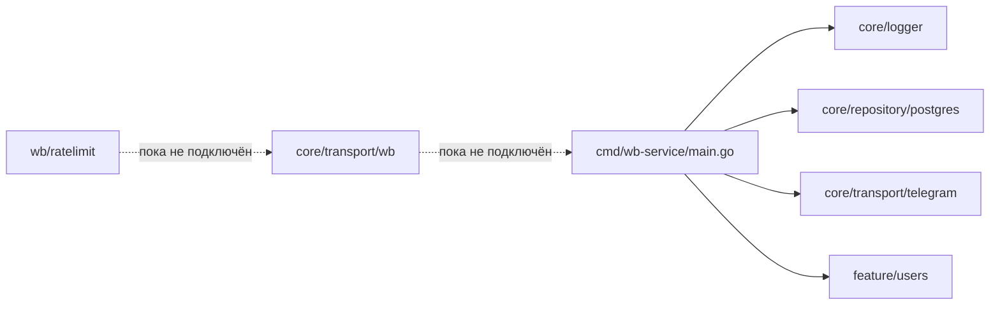
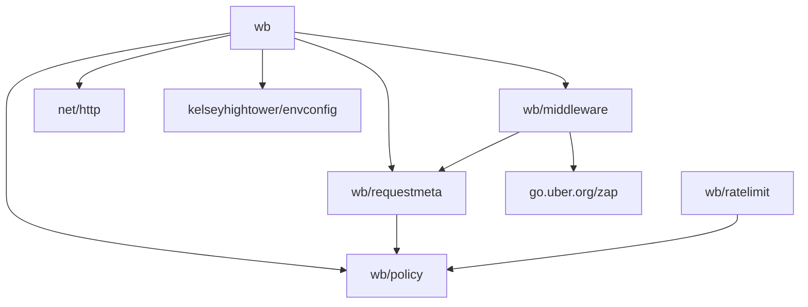
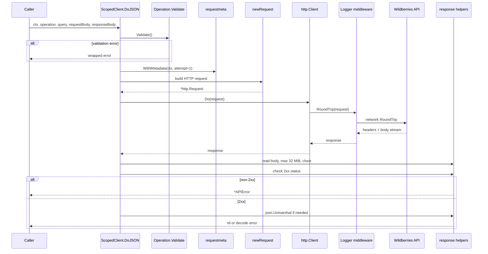
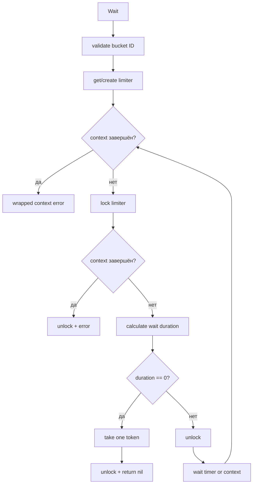
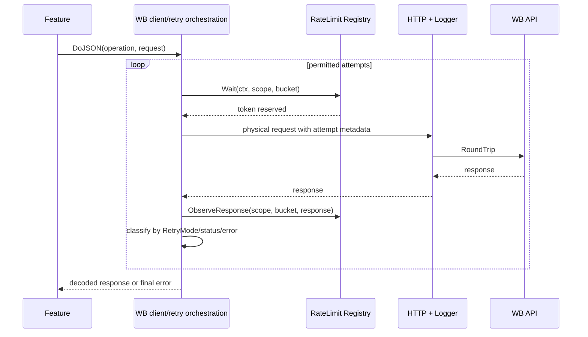

# Архитектура `internal/core/transport/wb`

## 1. Назначение документа

Этот документ описывает текущее состояние WB-транспорта в рабочем дереве репозитория на 2026-08-01. Под «WB-транспортом» далее понимается каталог [`internal/core/transport/wb`](../internal/core/transport/wb) и его подпакеты.

Единый актуальный план развития вынесен в документ
[`Master-план WB core с middleware`](wb-middleware-core-master-plan.md).
Он заменяет прежний executor-only completion plan и отдельные планы каталога,
RateLimit middleware и Retry middleware. Эти superseded-документы удалены;
история решений сведена в master-план.

Разбор отвечает на четыре разных вопроса:

1. Что уже реализовано в коде.
2. Что реально включено в исполняемый HTTP-путь.
3. Какие механизмы подготовлены архитектурно, но пока не подключены.
4. Какие ограничения и риски необходимо учитывать при дальнейшем развитии.

Это различие особенно важно для rate limiting и retry: соответствующие модели и часть логики существуют, но клиент пока их не выполняет автоматически.

## 2. Краткое резюме

`internal/core/transport/wb` — инфраструктурный HTTP-клиент для JSON API Wildberries. Он отделяет общую механику HTTP от конкретных бизнес-операций:

- конфигурация базового URL и таймаута;
- создание клиента и привязка credentials продавца;
- описание WB-операции как policy;
- сборка JSON-запроса;
- отправка через `net/http`;
- структурированное логирование одного HTTP-вызова;
- ограниченное чтение и JSON-декодирование ответа;
- унификация неуспешных HTTP-статусов через `APIError`;
- хранение request metadata в `context.Context`;
- самостоятельная реализация token bucket rate limiter.

Текущее фактическое состояние:

- `DoJSON` выполняет ровно один HTTP-вызов;
- logger middleware подключён;
- rate limiter не подключён к `Client` и не вызывается из других пакетов;
- retry loop отсутствует;
- `RetryMode` и `Attempt` пока только передаются как metadata;
- ни одной конкретной WB-операции в репозитории не объявлено;
- сам WB-клиент не создаётся в `cmd/wb-service/main.go`;
- автоматических тестов у WB-пакетов нет.

Следовательно, сегодня это скорее готовящееся инфраструктурное ядро интеграции, чем завершённый и включённый адаптер Wildberries.

## 3. Место в архитектуре приложения

Каталог расположен в `internal`, поэтому согласно правилам Go его могут импортировать только пакеты внутри дерева родительского модуля `github.com/ERONIS/wb-service`. Он не является публичной библиотекой для внешних проектов.

В текущем composition root [`cmd/wb-service/main.go`](../cmd/wb-service/main.go) создаются logger, PostgreSQL, Telegram server и user feature. WB-транспорт там не создаётся. Поиск по репозиторию также не обнаруживает потребителей `NewClient`, `DoJSON`, `NewRegistry`, `Wait` или `ObserveResponse` за пределами самих WB-пакетов.

Текущее положение выглядит так:



Архитектурная роль пакета — outbound adapter: бизнесовый/feature-код должен описывать конкретную операцию, передавать credentials, query/body и модель ответа, а транспорт должен отвечать за HTTP-механику.

## 4. Структура каталогов и ответственность файлов

| Путь | Ответственность |
|---|---|
| [`client.go`](../internal/core/transport/wb/client.go) | `Client`, `ScopedClient`, credentials, основной orchestration-метод `DoJSON` |
| [`config.go`](../internal/core/transport/wb/config.go) | загрузка `WB_API_*` конфигурации из environment |
| [`request.go`](../internal/core/transport/wb/request.go) | URL, query, JSON request body и HTTP-заголовки |
| [`response.go`](../internal/core/transport/wb/response.go) | ограниченное чтение body и JSON decoding |
| [`errors.go`](../internal/core/transport/wb/errors.go) | представление неуспешного HTTP-ответа через `APIError` |
| [`middleware/middleware.go`](../internal/core/transport/wb/middleware/middleware.go) | минимальная абстракция middleware над `http.RoundTripper` и сборка chain |
| [`middleware/logger.go`](../internal/core/transport/wb/middleware/logger.go) | логирование каждого физического HTTP-вызова |
| [`requestmeta/metadata.go`](../internal/core/transport/wb/requestmeta/metadata.go) | request-scoped metadata в `context.Context` |
| [`policy/operation.go`](../internal/core/transport/wb/policy/operation.go) | декларативное описание операции и retry mode |
| [`policy/bucket_id.go`](../internal/core/transport/wb/policy/bucket_id.go) | проверка идентификатора rate-limit bucket |
| [`policy/bucket_policy.go`](../internal/core/transport/wb/policy/bucket_policy.go) | параметры token bucket и их валидация |
| [`ratelimit/registry.go`](../internal/core/transport/wb/ratelimit/registry.go) | реестр policy и созданных limiter-экземпляров |
| [`ratelimit/registry_limiters.go`](../internal/core/transport/wb/ratelimit/registry_limiters.go) | поиск/ленивое создание limiter по scope и bucket |
| [`ratelimit/limiter.go`](../internal/core/transport/wb/ratelimit/limiter.go) | внутреннее состояние и математика token bucket |
| [`ratelimit/wait.go`](../internal/core/transport/wb/ratelimit/wait.go) | context-aware ожидание и резервирование токена |
| [`ratelimit/headers.go`](../internal/core/transport/wb/ratelimit/headers.go) | чтение и parsing WB rate-limit headers |
| [`ratelimit/response.go`](../internal/core/transport/wb/ratelimit/response.go) | коррекция локального limiter по ответу сервера |

## 5. Карта зависимостей

Зависимости между WB-пакетами направлены в одну сторону и не образуют циклов:



Важные следствия:

- `policy` — самый независимый слой: в нём только значения и правила валидации;
- `requestmeta` связывает контекст HTTP-запроса с policy-терминами;
- middleware не импортирует корневой пакет и потому не создаёт import cycle;
- `ratelimit` зависит только от policy и стандартной библиотеки;
- корневой `wb` сейчас не зависит от `ratelimit`, поэтому rate limiting не может происходить внутри `DoJSON`.

Имена Go-пакетов намеренно развёрнуты (`core_transport_wb`, `core_transport_wb_policy` и т. д.), хотя import path остаётся обычным `.../transport/wb`. В местах использования почти всегда задаются такие же длинные aliases. Это устраняет неоднозначность, но делает сигнатуры визуально тяжёлыми.

## 6. Публичная поверхность

### 6.1. Корневой пакет `wb`

Экспортирует:

- `Config`;
- `NewConfig()` и `NewConfigMust()`;
- `Client` и `NewClient()`;
- `Credentials`;
- `ScopedClient` и `Client.ForCredentials()`;
- `ScopedClient.DoJSON()`;
- `APIError`.

Поля `Client` и `ScopedClient` закрыты. После создания пользователь не может заменить `http.Client`, `RoundTripper`, clock, response limit или middleware chain.

### 6.2. `policy`

Экспортирует:

- `BucketID`;
- `RetryMode` и значения `RetryDisabled`, `RetrySafe`, `RetryRateLimitOnly`;
- `Operation`;
- `BucketPolicy`;
- методы/функции валидации.

### 6.3. `ratelimit`

Экспортирует только `Registry` и его операции:

- `NewRegistry()`;
- `Register(policy)`;
- `Wait(ctx, sellerScope, bucketID)`;
- `ObserveResponse(sellerScope, bucketID, response)`.

Сам `bucketLimiter` закрыт. Это полезная инкапсуляция: вызывающий код не может напрямую менять токены или обходить mutex.

### 6.4. `middleware` и `requestmeta`

Экспортируются building blocks:

- `Middleware`;
- `RoundTripperFunc`;
- `Chain()`;
- `Logger()`;
- `Metadata`;
- `WithMetadata()` и `FromContext()`.

Они позволяют строить новые transport middleware без зависимости от деталей `Client`.

## 7. Конфигурация

`Config` содержит два параметра:

| Environment | Поле | Default | Смысл |
|---|---|---:|---|
| `WB_API_BASE_URL` | `BaseURL` | `https://content-api.wildberries.ru` | базовый адрес API |
| `WB_API_TIMEOUT` | `Timeout` | `20s` | общий timeout `http.Client` |

`NewConfig()` использует `envconfig.Process("WB_API", &config)`. `NewConfigMust()` предназначен для composition root и паникует при ошибке parsing.

Особенности:

- `NewClient()` обрезает пробелы и завершающие `/` у `BaseURL`;
- явной проверки пустого/невалидного URL нет;
- положительность `Timeout` не валидируется; у `http.Client` значение `0` означает отсутствие общего timeout;
- default host относится к Content API. Если потребуются WB API с другими hosts, одной строки `BaseURL` на общий клиент может быть недостаточно;
- timeout `http.Client` покрывает весь обмен, включая redirects и чтение response body. Более детальные dial/TLS/header timeouts отдельно не настраиваются, но частично наследуются из clone стандартного transport.

## 8. Жизненный цикл клиента

### 8.1. `NewClient`

Создание происходит в четыре шага:

1. Нормализация `BaseURL`.
2. Clone `http.DefaultTransport.(*http.Transport)`.
3. Оборачивание clone через `middleware.Chain(..., Logger(logger))`.
4. Создание `http.Client` с полученным transport и configured timeout.

Clone стандартного transport — важное решение:

- сохраняются разумные стандартные настройки proxy, connection pooling, HTTP/2 и keep-alive;
- клиент получает отдельный изменяемый `*http.Transport`, не меняя глобальный `http.DefaultTransport`;
- connection pool переиспользуется всеми scoped clients одного `Client`;
- `Client` следует создавать один раз и переиспользовать, а не создавать на каждый запрос.

`NewClient` требует непустой `*zap.Logger`: middleware вызовет panic, если logger равен `nil`. Ошибка не возвращается, поэтому неверная dependency injection проявляется немедленно при старте.

Конструктор делает type assertion `http.DefaultTransport.(*http.Transport)`. В обычном процессе это корректно, но `http.DefaultTransport` — изменяемая package variable. Если другой код предварительно заменит её реализацией только интерфейса `http.RoundTripper`, конструктор завершится panic ещё до logger validation.

Текущее ограничение тестируемости: конструктор всегда берёт clone default transport и всегда добавляет logger. Публичной опции внедрить mock `RoundTripper` или готовый `http.Client` нет.

### 8.2. `ForCredentials`

`Client.ForCredentials(credentials)`:

- trim-ит `Scope` и `Token`;
- копирует credentials по значению;
- возвращает лёгкий `ScopedClient`, ссылающийся на общий `Client`.

Разделение имеет хороший смысл:

- transport и connection pool общие;
- авторизация и логический scope конкретного продавца находятся в scoped object;
- один базовый клиент может безопасно обслуживать несколько продавцов.

При этом:

- пустые `Scope` и `Token` не валидируются в момент создания;
- `Token` передаётся в `Authorization` ровно в исходном виде: префикс `Bearer` автоматически не добавляется;
- `Scope` не уходит в сеть. Сейчас он только попадает в metadata и потенциально предназначен для partitioning rate limiter;
- отдельного lifecycle/очистки у `ScopedClient` нет.

`http.Client`, стандартный transport и immutable credentials позволяют безопасно переиспользовать `Client` и `ScopedClient` из нескольких goroutines, пока закрытые поля не меняются после создания.

## 9. Модель операции

`policy.Operation` — декларативное описание endpoint-вызова:

```go
type Operation struct {
    Name      string
    Method    string
    Path      string
    BucketID  BucketID
    RetryMode RetryMode
}
```

Назначение полей:

| Поле | Используется сейчас | Назначение |
|---|---|---|
| `Name` | logger metadata | стабильное семантическое имя операции |
| `Method` | `http.NewRequestWithContext` | HTTP method |
| `Path` | сборка URL | относительный endpoint path |
| `BucketID` | только metadata в `DoJSON` | группа общего rate limit |
| `RetryMode` | только metadata в `DoJSON` | предполагаемая policy повторов |

`Validate()` проверяет:

- непустой `Name` после trim;
- непустой `Method` после trim;
- наличие `/` в начале `Path`;
- непустой `BucketID` после trim.

Не проверяются:

- принадлежность `Method` известным HTTP methods;
- отсутствие пробелов/недопустимых символов в method;
- допустимое значение `RetryMode`;
- host/query/fragment внутри `Path`;
- соответствие retry mode идемпотентности операции;
- регистрация `BucketID` в rate-limit registry.

Текущая модель связывает одну операцию ровно с одним bucket. Это упрощает locking и accounting, но не моделирует endpoint, одновременно расходующий несколько независимых квот.

Семантика названий retry modes предположительно такова:

- `RetryDisabled` — не повторять;
- `RetrySafe` — можно повторять безопасные временные ошибки;
- `RetryRateLimitOnly` — повторять только после rate-limit ответа.

Однако это только интерпретация API enum по именам. Реального кода, который ветвится по этим значениям, сейчас нет.

## 10. Фактический поток `DoJSON`

### 10.1. Sequence diagram



### 10.2. Подробно по шагам

1. `operation.Validate()` выполняется до создания запроса и до сети.
2. Исходный `ctx` оборачивается через `requestmeta.WithMetadata`.
3. Metadata содержит seller scope, operation name, bucket ID, retry mode и `Attempt: 1`.
4. `newRequest` собирает URL и при необходимости сериализует body.
5. `http.Client.Do` запускает logger middleware и стандартный transport.
6. После получения response headers middleware пишет лог и возвращает response выше.
7. `readResponseBody` полностью читает body с лимитом и всегда закрывает его.
8. `checkResponseStatus` принимает только диапазон `200..299`.
9. Для успешного ответа `decodeResponseBody` при необходимости выполняет `json.Unmarshal`.

Вызов не содержит цикла, поэтому физический HTTP-запрос всегда один, если не учитывать автоматические redirects внутри `http.Client`. `Attempt` всегда равен `1`.

### 10.3. Поведение контекста

Переданный `context.Context` используется корректно:

- участвует в создании `http.Request`;
- cancellation/deadline передаются в `net/http`;
- metadata доступна middleware из `request.Context()`;
- context error возвращается обёрнутым стандартным HTTP error из `sendRequest`.

Клиент дополнительно ограничивает вызов `Config.Timeout`. Сработает наиболее раннее ограничение: deadline вызывающего кода или timeout клиента.

## 11. Сборка HTTP-запроса

`newRequest` отвечает за transport-level representation.

### 11.1. URL

URL собирается простой конкатенацией:

```text
normalizedBaseURL + "/" + strings.TrimLeft(path, "/")
```

Это гарантирует один разделительный slash между base URL и path для обычных входов. Затем, если `url.Values` не пуст, добавляется `?` и `query.Encode()`.

Плюсы `url.Values.Encode()`:

- корректное percent encoding;
- поддержка нескольких значений одного ключа;
- детерминированный порядок ключей.

Ограничения простой конкатенации:

- `BaseURL` заранее не разбирается через `url.Parse`;
- base URL с query/fragment может дать некорректный результат;
- query, уже вручную включённый в `Operation.Path`, не запрещён;
- path не строится через URL-aware join;
- ошибка окончательного URL обнаружится только в `http.NewRequestWithContext`.

### 11.2. Request body

Если `requestBody != nil`:

- выполняется `json.Marshal`;
- bytes хранятся в памяти;
- создаётся `bytes.Reader`;
- устанавливается `Content-Type: application/json`.

Если body равен `nil`, request body отсутствует и `Content-Type` не ставится.

Следствия:

- streaming upload не поддерживается;
- весь payload должен помещаться в память;
- переданный typed nil внутри interface может вести себя как ненулевой interface и сериализоваться в JSON `null`;
- ошибки unsupported types, циклических значений и `MarshalJSON` возвращаются до сети.

Так как в `http.NewRequestWithContext` передаётся `*bytes.Reader`, стандартная библиотека также выставляет известный `ContentLength` и функцию `GetBody`. Это полезная заготовка для redirects и будущего retry, но само по себе повторные попытки не запускает: retry orchestration всё равно должен заново получать body или пересобирать request.

### 11.3. Заголовки

Всегда устанавливаются:

- `Accept: application/json`;
- `Authorization: <credentials.Token>`.

Для ненулевого body дополнительно:

- `Content-Type: application/json`.

API для дополнительных per-request headers отсутствует. Это затруднит endpoint-ы, требующие специальных headers, correlation ID, условных запросов или другого content type.

Токен не попадает в logger middleware: logger пишет method, host и path, но не headers/query/body. Это хорошая граница с точки зрения секретов.

## 12. HTTP transport и middleware chain

### 12.1. Абстракция

`middleware.Middleware` имеет стандартную форму decorator:

```go
type Middleware func(next http.RoundTripper) http.RoundTripper
```

`RoundTripperFunc` адаптирует функцию к интерфейсу `http.RoundTripper`. `Chain` применяет middleware с конца списка, поэтому первый переданный middleware оказывается внешним.

Для вызова:

```go
Chain(base, A, B, C)
```

порядок исполнения будет:

```text
A before -> B before -> C before -> base -> C after -> B after -> A after
```

Если `transport == nil`, `Chain` использует `http.DefaultTransport`. В `NewClient` передаётся ненулевой clone.

### 12.2. Logger middleware

Logger замеряет время вокруг `next.RoundTrip(request)` и формирует поля:

- `component=wb`;
- HTTP `method`;
- URL `host`;
- URL `path`;
- `duration`;
- при наличии metadata — `operation` и `attempt`;
- при наличии response — `status_code`.

Уровни:

- network/transport error → `Error`;
- HTTP status `>= 400` → `Warn`;
- остальные ответы → `Debug`.

Важная семантика duration: middleware измеряет время до возврата `RoundTrip`, то есть обычно до получения response headers, а не до полного чтения body. Декодирование и чтение body происходят выше middleware и в это время не входят.

Logger не знает о `APIError`, потому что status преобразуется в `APIError` после завершения RoundTrip и чтения body.

Возможные ограничения:

- redirects могут привести к нескольким физическим RoundTrip и нескольким логам для одного `DoJSON`;
- query намеренно не логируется, что безопаснее, но может уменьшить диагностичность;
- seller scope, bucket и retry mode в metadata сейчас не логируются;
- если некорректный пользовательский RoundTripper вернёт одновременно `nil` response и `nil` error, logger разыменует `response`; стандартный transport так не делает;
- logger является обязательным dependency и не может быть отключён через публичную конфигурацию.

## 13. Metadata в context

`requestmeta.Metadata` содержит:

```go
type Metadata struct {
    SellerScope   string
    OperationName string
    BucketID      policy.BucketID
    RetryMode     policy.RetryMode
    Attempt       int
}
```

Metadata сохраняется через приватный пустой тип `contextKey`. Это предотвращает collision с ключами других пакетов.

Текущий producer — `DoJSON`. Текущий consumer — только logger middleware, причём он использует лишь `OperationName` и `Attempt`.

Остальные поля являются точкой расширения для будущих middleware:

- rate limiter сможет получить `(SellerScope, BucketID)`;
- retry middleware сможет прочитать `RetryMode`;
- logger/metrics смогут группировать вызовы по operation/bucket/attempt.

Все поля — значения или immutable string-like types, поэтому дополнительное defensive copying не требуется.

Не следует использовать metadata как обязательный бизнесовый input: контекстная запись может отсутствовать, и `FromContext` явно возвращает `(Metadata, bool)`.

## 14. Обработка response

### 14.1. Ограниченное чтение

`readResponseBody`:

- откладывает `response.Body.Close()`;
- читает через `io.LimitReader` максимум `32 MiB + 1 byte`;
- возвращает ошибку, если фактический размер больше `32 MiB`;
- оборачивает ошибки чтения.

Чтение дополнительного байта позволяет отличить body размером ровно 32 MiB от превышения лимита.

Зачем нужен лимит:

- защищает процесс от неограниченного выделения памяти на неожиданно большом ответе;
- ограничивает размер текста, который может попасть в `APIError`.

Ограничения:

- лимит compile-time и не конфигурируется;
- response всё равно полностью буферизуется перед decode;
- при превышении лимита остаток body не дренируется, поэтому конкретное соединение может не вернуться в keep-alive pool;
- даже error response сначала читается целиком до лимита.

### 14.2. Проверка статуса

Успешным считается любой `2xx`. Все остальные финальные статусы превращаются в `*APIError`.

`APIError` сохраняет:

- числовой `StatusCode`;
- body как необработанную строку.

Его `Error()` формирует сообщение вида:

```text
WB API returned status 400 Bad Request: <body>
```

Если body пуст, suffix не добавляется. Поскольку тип экспортирован, вызывающий код может использовать `errors.As(err, &apiErr)` и ветвиться по status code.

Ограничения:

- structured WB error JSON не разбирается;
- response headers, включая retry headers и request ID, в `APIError` не сохраняются;
- потенциально большой/чувствительный body становится частью error string;
- `3xx` обычно сначала обрабатываются redirect policy стандартного `http.Client`, а `APIError` увидит только финальный ответ, если redirect не был превращён в transport error.

### 14.3. JSON decoding

Decode пропускается, если:

- body пуст; или
- `responseBody == nil`.

Иначе вызывается `json.Unmarshal(body, responseBody)`.

Следствия:

- `204 No Content` естественно поддерживается;
- вызывающий код может сознательно проигнорировать успешный body;
- неизвестные JSON-поля игнорируются;
- trailing non-whitespace data будет ошибкой `json.Unmarshal`;
- для заполнения результата обычно требуется передать non-nil pointer;
- content type ответа не проверяется;
- успешный пустой body при ожидаемой модели не считается ошибкой.

## 15. Классификация ошибок

Потенциальные ошибки возникают по стадиям:

| Стадия | Пример | Происходит до сети |
|---|---|---|
| Policy validation | пустое имя, path без `/`, пустой bucket | да |
| JSON marshal | неподдерживаемое значение body | да |
| Request creation | невалидный method/URL | да |
| HTTP transport | DNS, dial, TLS, timeout, cancellation | нет |
| Response read | broken stream, превышение 32 MiB | нет |
| HTTP status | `*APIError` для non-2xx | нет |
| JSON decode | несовместимая модель результата | нет |

Ошибки последовательно оборачиваются через `%w`, поэтому `errors.Is`/`errors.As` сохраняют причинную цепочку. Текст некоторых wrapper-сообщений не содержит двоеточия перед вложенной ошибкой, но на программную обработку это не влияет.

Сейчас нет специальной taxonomy для определения retryability. Retry-механизму пришлось бы различать как минимум:

- context cancellation/deadline, которые обычно нельзя повторять внутри того же context;
- временные transport errors;
- `429`;
- `5xx`;
- остальные `4xx`;
- marshal/decode/policy errors, которые повтор не исправит.

## 16. Rate limiter: модель данных

### 16.1. Bucket policy

`BucketPolicy` задаёт:

```go
type BucketPolicy struct {
    ID       BucketID
    Interval time.Duration
    Burst    int
}
```

Смысл:

- `ID` — логическое имя общей квоты;
- `Interval` — время восстановления одного токена;
- `Burst` — максимальная ёмкость bucket и начальное количество токенов.

Validation требует непустой ID, положительный interval и положительный burst.

Например, `Interval=100ms, Burst=5` означает:

- первые пять reservations могут пройти немедленно;
- затем восстанавливается примерно один токен каждые 100 ms;
- накопить больше пяти токенов нельзя.

### 16.2. Partition key

Limiter создаётся для пары:

```text
(trimmed sellerScope, bucketID)
```

Это означает:

- два sellers с одним bucket не блокируют друг друга;
- две операции одного seller с одинаковым bucket разделяют квоту;
- разные buckets одного seller независимы;
- регистр символов в `sellerScope` и точное значение `BucketID` значимы;
- token не является ключом и не хранится в registry.

Выбор стабильного `sellerScope` критичен. Если на каждый вызов передавать новый scope, limiter не будет агрегировать квоту и map будет неограниченно расти.

### 16.3. Registry

`Registry` хранит две map:

- `policies[BucketID]BucketPolicy`;
- `limiters[limiterKey]*bucketLimiter`.

`Register`:

1. валидирует policy;
2. под write lock проверяет существующую запись;
3. впервые добавляет policy;
4. повторную идентичную регистрацию считает успешной;
5. конфликтующую регистрацию того же ID отклоняет.

Таким образом, registration идемпотентна, но policy immutable после первого успешного объявления. API обновления/удаления нет.

Limiter создаётся лениво при первом `Wait` или при первом информативном `ObserveResponse`. Policy к этому моменту уже должна быть зарегистрирована.

## 17. Rate limiter: состояние и математика

Каждый внутренний `bucketLimiter` содержит:

| Поле | Значение |
|---|---|
| `policy` | immutable параметры bucket |
| `tokens float64` | локально доступные, включая дробную часть |
| `lastRefill` | момент последнего пересчёта |
| `blockedUntil` | server-directed запрет после `429` |
| `mutex` | защита всех изменяемых полей limiter |

Новый limiter стартует с `tokens = Burst`.

### 17.1. Refill

При времени `now > lastRefill` добавляется:

```text
elapsed / policy.Interval
```

Количество ограничивается сверху `Burst`. Дробные токены сохраняются. После расчёта `lastRefill` становится `now`.

### 17.2. Расчёт ожидания

`waitDurationLocked(now)`:

1. Если `now < blockedUntil`, возвращает оставшееся время server block.
2. Иначе выполняет refill.
3. Если `tokens >= 1`, возвращает `0`.
4. Иначе считает `missingTokens = 1 - tokens`.
5. Возвращает `ceil(missingTokens * Interval)`.

`ceil` не позволяет проснуться на долю наносекунды раньше момента появления полного токена.

### 17.3. Резервирование

Когда wait duration равен нулю, `takeLocked()` уменьшает tokens на единицу до снятия mutex. Это именно reservation: конкурентная goroutine уже не сможет забрать тот же токен.

Токен не возвращается, если последующая сборка/отправка запроса не состоялась. При будущей интеграции важно ставить `Wait` как можно ближе к физическому RoundTrip либо осознанно принять консервативную потерю токена.

## 18. `Registry.Wait`

`Wait(ctx, sellerScope, bucketID)` выполняет context-aware admission control.

Алгоритм:



Двойная проверка context до и после захвата mutex уменьшает окно, в котором уже отменённый вызов мог бы зарезервировать токен.

Свойства:

- ожидание не держит limiter mutex;
- разные limiter keys ждут независимо;
- несколько waiter-ов на одном bucket могут проснуться одновременно, но токен получит только один;
- строгой FIFO fairness нет;
- на каждую итерацию создаётся новый `time.Timer`;
- context cancellation останавливает текущий timer и возвращается как wrapped error.

## 19. Коррекция по response headers

`ObserveResponse` знает четыре WB headers:

| Header | Парсится | Используется |
|---|---:|---:|
| `X-Ratelimit-Remaining` | да | да, для non-429 |
| `X-Ratelimit-Retry` | да | да, для `429` |
| `X-Ratelimit-Limit` | да | нет |
| `X-Ratelimit-Reset` | да | нет |

`http.Header.Get` регистронезависим, значение trim-ится и парсится как decimal `int`. Отсутствующий header представлен `nil`, а не нулём.

### 19.1. Обычный ответ

Для любого статуса, кроме `429`, если есть `X-Ratelimit-Remaining`, вызывается `clampRemainingLocked`:

1. сначала выполняется локальный refill;
2. `tokens = min(localTokens, serverRemaining)`.

Limiter может уменьшить локальную оценку по серверу, но никогда не увеличивает её. Это консервативная стратегия: сервер считается источником информации о более строгом остатке, но не разрешает локальный burst сверх уже рассчитанного.

### 19.2. `429 Too Many Requests`

Если присутствует `X-Ratelimit-Retry`, seconds превращаются в `time.Duration` и вызывается `applyRetryLocked`:

- `blockedUntil = now + retryDuration`, если новый момент позже текущего;
- `tokens = 0`;
- `lastRefill = blockedUntil - Interval`.

Последняя формула даёт примерно один доступный токен сразу после окончания блокировки. Накопление полного burst во время server block не происходит.

Повторный `429` может только продлить текущий block, но не сократить его.

### 19.3. Ранние выходы

Метод ничего не делает, если:

- `response == nil`;
- для `429` отсутствует retry header;
- для другого статуса отсутствует remaining header.

В этих случаях limiter может даже не создаваться, а отсутствие зарегистрированной policy останется незамеченным.

### 19.4. Строгость parsing

Сначала парсятся все четыре headers. Поэтому malformed значение даже пока неиспользуемого `X-Ratelimit-Limit` или `X-Ratelimit-Reset` делает весь `ObserveResponse` ошибочным.

Числовые диапазоны не проверяются:

- отрицательный `Remaining` может сделать `tokens` отрицательными и сильно увеличить ожидание;
- нулевой/отрицательный `Retry` не создаёт полезной паузы;
- слишком большие seconds могут привести к overflow при преобразованиях duration;
- `Limit` не сверяется с configured `Burst`;
- `Reset` не участвует в восстановлении.

## 20. Модель конкурентности

Rate-limit слой использует два уровня locking.

### 20.1. Registry lock

`Registry.mutex` защищает обе map и операции:

- registration policy;
- поиск existing limiter;
- создание и публикацию нового limiter.

Хотя поле имеет тип `sync.RWMutex`, текущий код использует только `Lock`, даже для lookup. Это упрощает атомарный путь «найти или создать», но сериализует все обращения к registry на коротком участке.

### 20.2. Per-limiter lock

После получения pointer глобальный lock уже снят. `bucketLimiter.mutex` защищает tokens/timestamps конкретного ключа.

Преимущества:

- сетевое ожидание и timers не держат глобальный lock;
- разные sellers/buckets не сериализуются по state update;
- нет вложенного удержания registry mutex и limiter mutex, что уменьшает риск deadlock.

### 20.3. Lifecycle и память

Registry не удаляет policies и limiters. Для фиксированного набора seller scopes это нормально. При неограниченной cardinality scope map будет расти всю жизнь процесса. TTL/eviction/metrics размера сейчас отсутствуют.

## 21. Что не подключено

Это самый важный раздел для правильного понимания текущего кода.

### 21.1. Rate limiter не участвует в запросе

Корневой пакет `wb` не импортирует `wb/ratelimit`. `NewClient` не принимает `Registry`. Middleware chain содержит только logger. `DoJSON` не вызывает ни `Wait`, ни `ObserveResponse`.

Значит:

- запрос не ждёт свободного токена;
- `429` не блокирует следующие запросы;
- response headers не корректируют локальное состояние;
- `BucketID` не влияет на фактическое выполнение.

### 21.2. Retry отсутствует

Нет retry middleware и retry loop. `RetryMode` нигде не читается, кроме помещения в metadata, а logger его не выводит. `Attempt` всегда `1`.

Значит:

- transport errors не повторяются;
- `429` не повторяется;
- `5xx` не повторяются;
- backoff и jitter отсутствуют;
- request body replayability пока не решается.

### 21.3. Нет concrete operations

В кодовой базе нет значений `policy.Operation` для конкретных WB endpoints и нет зарегистрированных `BucketPolicy`. Поэтому protocol abstraction пока не привязана к реальному API surface.

### 21.4. Нет wiring в приложение

`cmd/wb-service/main.go` не загружает `WB_API_*` config и не создаёт client/registry. Feature-пакеты WB-транспорт не импортируют.

## 22. Как должен выглядеть полный flow после интеграции

Ниже не описание текущего поведения, а архитектурно естественная схема сборки уже существующих частей:



При реализации нужно принять явные решения:

- rate limiting будет middleware или частью orchestration `DoJSON`;
- кто регистрирует policies;
- сколько максимальных attempts;
- какие statuses/errors retryable для каждого `RetryMode`;
- где backoff/jitter и как он сочетается с `X-Ratelimit-Retry`;
- как обновлять `Attempt` в context на каждой попытке;
- когда читать/закрывать body до retry;
- как безопасно replay JSON body;
- возвращать ли зарезервированный токен при ошибке до физической отправки;
- должна ли ошибка `ObserveResponse` перекрывать основной HTTP-результат.

## 23. Сильные стороны текущего дизайна

1. Ответственности разделены по небольшим пакетам и файлам.
2. Dependency graph ацикличен и оставляет policy независимой.
3. Один базовый client переиспользует connection pool для многих sellers.
4. Credentials изолированы в `ScopedClient`, а token не логируется.
5. Operation представляет семантику endpoint отдельно от payload DTO.
6. Metadata передаётся через context без изменения HTTP API.
7. Middleware следует стандартному decorator-паттерну `RoundTripper`.
8. Response body ограничен по размеру и всегда закрывается.
9. `APIError` сохраняет status code для `errors.As`.
10. Rate limiter partitioned по seller и bucket.
11. Token bucket использует дробные tokens и поддерживает burst.
12. Server-reported remaining только ужесточает локальную оценку.
13. Server retry block может только продлеваться.
14. Registry registration идемпотентна и защищает от конфликтующих policy.
15. Locking разделён на registry и per-limiter уровни; timers не выполняются под lock.
16. `Wait` уважает cancellation/deadline context.

## 24. Ограничения и риски

### 24.1. Критичные для функциональной готовности

| Приоритет | Проблема | Последствие |
|---|---|---|
| P0 | WB client не создаётся в приложении | функциональность не используется |
| P0 | rate limiter не включён в HTTP flow | локальное ограничение запросов отсутствует |
| P0 | retry modes не исполняются | API enum создаёт ложное ожидание устойчивости |
| P0 | нет concrete operations/policies | невозможно использовать abstraction без дополнительного кода |

### 24.2. Надёжность и корректность

| Приоритет | Проблема | Последствие |
|---|---|---|
| P1 | нет валидации credentials | пустой token обнаружится только ответом сервера; пустой scope — позже в limiter |
| P1 | нет валидации base URL/timeout | configuration error проявляется поздно |
| P1 | небезопасный type assertion над изменяемым `http.DefaultTransport` | замена default transport другим кодом приводит к panic |
| P1 | `RetryMode` принимает любое `uint8` | неизвестная policy может попасть в runtime |
| P1 | response header values не проверяются по диапазону | некорректные server/proxy headers портят limiter state |
| P1 | malformed неиспользуемый header ломает observation | полезный remaining/retry может быть проигнорирован из-за unrelated field |
| P1 | отсутствующие headers на `429` игнорируются | следующие вызовы не получают server-directed pause |
| P1 | token reservation и request execution пока не объединены | при интеграции легко неверно расходовать токены |
| P1 | `ObserveResponse` не сохраняет headers в `APIError` | retry orchestration выше клиента теряет сведения после обработки ответа |

### 24.3. Эксплуатация

| Приоритет | Проблема | Последствие |
|---|---|---|
| P2 | нет metrics | невозможно видеть queue time, tokens, 429 и retry counts |
| P2 | нет eviction limiter-ов | память растёт с cardinality seller scopes |
| P2 | logger duration не включает body/decode | latency в логах ниже end-to-end latency |
| P2 | нет correlation/request ID | сложнее связывать лог с ответом WB |
| P2 | error body целиком включается в error string | риск шумных или чувствительных логов |
| P2 | fixed 32 MiB limit | нельзя настроить под разные endpoints |
| P2 | нет graceful close idle connections | отсутствует явный lifecycle transport при shutdown |

### 24.4. Тестируемость и API flexibility

| Приоритет | Проблема | Последствие |
|---|---|---|
| P1 | тестов нет | concurrency, parsing и error paths не защищены |
| P2 | нельзя внедрить `RoundTripper`/`http.Client` | unit-тест клиента сложнее, нужен реальный local server |
| P2 | используется реальный `time.Now`/timer | deterministic тесты limiter сложнее |
| P2 | дополнительные headers не поддерживаются | часть endpoints потребует изменения общего API |
| P2 | только JSON buffered request/response | streaming и другие formats не поддерживаются |
| P2 | один bucket на operation | нельзя выразить пересечение нескольких квот |

## 25. Рекомендованный порядок развития

### Этап 1. Зафиксировать contracts тестами

До wiring стоит добавить unit tests для уже существующего поведения:

- `Operation.Validate` и `BucketPolicy.Validate`;
- idempotent/conflicting `Registry.Register`;
- partitioning по scope/bucket;
- initial burst и последовательный refill;
- cancellation `Wait`;
- `Remaining` clamp;
- `429 Retry` block и его продление;
- malformed/missing/negative headers;
- 32 MiB response boundary;
- `APIError` и `errors.As`;
- request URL, query, headers и JSON body;
- logger metadata/attempt.

Особенно нужны race/concurrency tests и запуск `go test -race`.

### Этап 2. Уточнить policy semantics

Нужно документированно определить:

- список concrete operations;
- стабильные bucket IDs;
- policies по документации WB;
- допустимые retry modes;
- maximum attempts;
- backoff/jitter;
- обработку `Retry`, `Reset`, `Remaining`, `Limit` и отсутствующих headers.

### Этап 3. Добавить dependency injection

Практичный вариант — constructor options для:

- custom `http.RoundTripper` или `*http.Client`;
- middleware;
- rate-limit registry;
- clock/timer abstraction для тестов;
- configurable response limit.

При этом production default может остаться таким же.

### Этап 4. Собрать rate-limit flow

Для каждой физической попытки:

1. получить metadata;
2. дождаться token через `Wait`;
3. выполнить RoundTrip;
4. передать response в `ObserveResponse` как можно раньше;
5. корректно закрыть/drain body;
6. решить retry/final return.

Rate limiting удобен как middleware, но retry loop обычно должен быть внешнее него: тогда каждая физическая попытка заново проходит admission control и логируется с отдельным attempt.

Предпочтительный порядок chain:

```text
retry orchestration
  -> per-attempt metadata
    -> rate-limit wait/observe
      -> logger
        -> base transport
```

Точный порядок зависит от того, должна ли queue duration входить в logged duration и какие metrics нужны.

### Этап 5. Wiring и feature-level adapter

В composition root нужно:

1. загрузить WB config;
2. создать shared client;
3. создать registry;
4. зарегистрировать bucket policies;
5. передать WB dependency в feature service;
6. хранить/получать seller credentials безопасным способом;
7. определить lifecycle и shutdown idle connections.

Feature-коду желательно зависеть не от concrete `*ScopedClient`, а от узкого интерфейса нужных ему WB-операций. Тогда generic HTTP transport останется инфраструктурной деталью.

## 26. Рекомендованные тестовые сценарии

### 26.1. Client/request/response

- base URL с завершающими slash и пробелами;
- path с одним и несколькими начальными slash;
- query с пробелами, Unicode и несколькими values;
- nil body и JSON body;
- пустой/явный authorization token;
- `200` с JSON, `204`, malformed JSON;
- `400` с body и без body;
- response ровно 32 MiB и 32 MiB + 1;
- cancellation и client timeout;
- redirect behavior;
- отсутствие утечки Authorization в логи.

### 26.2. Middleware

- порядок `Chain(A, B, C)`;
- fallback к default transport при nil;
- log levels для success/HTTP error/transport error;
- metadata exists/missing;
- отдельный лог на каждую физическую attempt.

### 26.3. Rate limiter

- burst одновременных goroutines;
- независимость разных scopes;
- совместная квота разных operations с одним bucket;
- отсутствие двойной выдачи одного токена;
- waiter cancellation до lock, после lock и во время timer;
- clamp вниз и запрет clamp вверх;
- immediate token после окончания retry block;
- повторный более короткий/длинный retry;
- race между `Wait`, `ObserveResponse` и `Register`;
- unregistered policy;
- пустой scope/bucket;
- высокая cardinality scopes.

## 27. Пример предполагаемого использования существующего API

Пример ниже показывает раздельные части API, но не означает, что client автоматически вызывает limiter. Имена operation, bucket и endpoint здесь условны и не являются справочником актуальных endpoint-ов WB:

```go
const cardsBucket policy.BucketID = "content.cards"

operation := policy.Operation{
    Name:      "list-cards",
    Method:    http.MethodPost,
    Path:      "/example/cards/list",
    BucketID:  cardsBucket,
    RetryMode: policy.RetrySafe,
}

registry := ratelimit.NewRegistry()
if err := registry.Register(policy.BucketPolicy{
    ID:       cardsBucket,
    Interval: 100 * time.Millisecond,
    Burst:    5,
}); err != nil {
    return err
}

client := wb.NewClient(config, logger)
sellerClient := client.ForCredentials(wb.Credentials{
    Scope: "seller-42",
    Token: token,
})

// В текущей реализации Wait приходится вызывать вручную.
if err := registry.Wait(ctx, "seller-42", cardsBucket); err != nil {
    return err
}

var result CardsResponse
if err := sellerClient.DoJSON(ctx, operation, query, request, &result); err != nil {
    return err
}
```

Даже этот ручной вариант неполон: `DoJSON` не отдаёт `*http.Response`, поэтому вызывающий код не может после него передать response в `ObserveResponse`. Это ещё раз показывает, что полноценную интеграцию observation следует делать внутри transport pipeline, а не на feature-уровне.

## 28. Итоговая оценка

Пакет имеет хорошую основу: понятное разделение responsibility, стандартную HTTP middleware abstraction, безопасное переиспользование transport, request metadata, ограничение response body и аккуратно синхронизированный token bucket с server feedback.

Главный архитектурный разрыв находится не внутри отдельных алгоритмов, а между ними: `Client`, `requestmeta`, `policy` и `ratelimit` пока не собраны в единый execution pipeline. Из-за этого наиболее заметные типы — `BucketID`, `RetryMode`, `Registry` — пока не влияют на реальный вызов WB API.

До production-ready состояния приоритетно нужны:

1. tests, особенно concurrency и header edge cases;
2. формальная retry/rate-limit semantics;
3. wiring limiter и retries вокруг каждой физической attempt;
4. concrete operations и bucket policies;
5. dependency injection и metrics;
6. подключение клиента в composition root и feature adapter.

После этих шагов текущая структура может стать устойчивым общим транспортным слоем для нескольких WB endpoints и нескольких seller scopes без смешивания инфраструктурной HTTP-логики с бизнесовыми use cases.

## 29. Проверка анализа

Выводы в документе сверены следующими способами:

- просмотрены все Go-файлы `internal/core/transport/wb` и подпакетов;
- поиском по репозиторию проверены consumers экспортированных constructors и методов;
- отдельно просмотрен composition root `cmd/wb-service/main.go`;
- построен фактический import graph через `go list`;
- `go test ./internal/core/transport/wb/...` успешно компилирует все WB-пакеты и сообщает `[no test files]`;
- `go vet ./internal/core/transport/wb/...` завершается без замечаний.

Полный `go test ./...` в текущем локальном окружении не доходит до проверки всех packages из-за запрета чтения каталога `out/pgdata/18/docker`. Это инфраструктурное ограничение рабочего каталога, а не compile error WB-пакетов.
